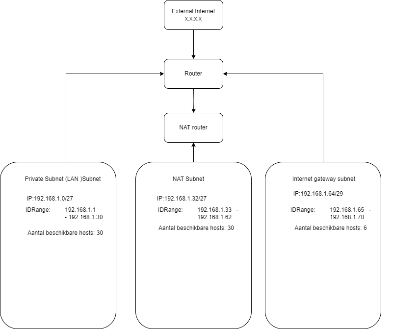

# [Subnetting]
[Geef een korte beschrijving van het onderwerp]

## Key-terms
- LAN: Local Area Network 
- Host
- subnet Mask (prefix)
- CIDR notation = Classless Inter-Domain Routing
- VLSM = variable-length subnet mask

## Opdracht
### Gebruikte bronnen
[Subnet masks & prefixes](https://www.ibm.com/docs/en/ts3500-tape-library?topic=formats-subnet-masks-ipv4-prefixes-ipv6)
- [CIDR](https://aws.amazon.com/what-is/cidr/)
- [yt uitleg subnetting](https://www.youtube.com/watch?v=ecCuyq-Wprc)

- [CIDR tool](https://app.diagrams.net/)
- [subnetting calculator](https://www.calculator.net/ip-subnet-calculator.html)

Stappenplan:    
1: Arrange the networks from the largest to the smallest
2: Pick a subnet for the largest network
3: Pick the next largest 
4: repeat step 3 until done

### Ervaren problemen
Moeite met het visueel maken van de diagram.
Oplossing: demo + uitleg via chatgpt opgevraagd en hulp van groepsgenoten gevraagd. Nieuwe informatie opgezocht en toegepast. Uiteindelijk is alle materie op z'n plek gevallen

### Resultaat

