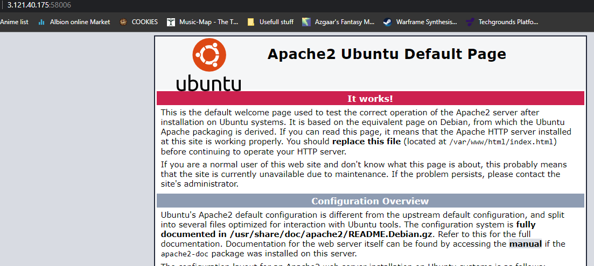
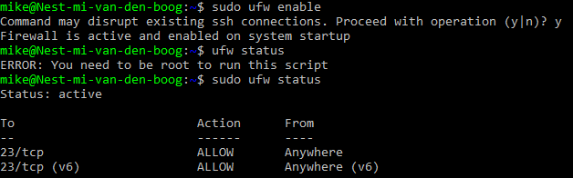
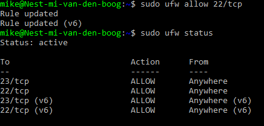
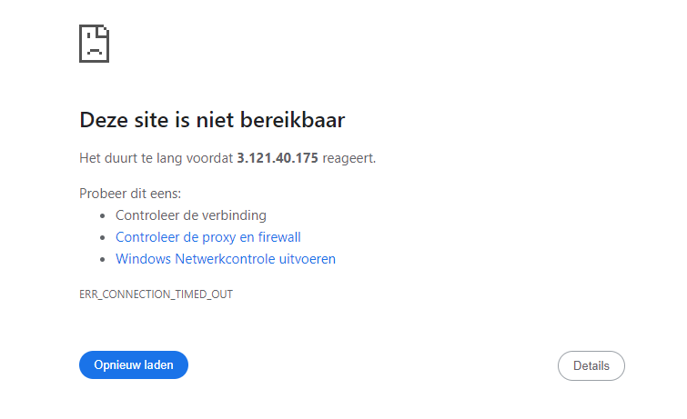

# [Firewalls]
Installeer een webserver op je VM. Bekijk de standaardpagina die met de webserver geïnstalleerd is via een browser (niet via de vm maar eigen pc/laptop)
Stel de firewall zo in dat je webverkeer blokkeert maar wel ssh-verkeer toelaat en controleer of de firewall zijn werk doet.

## Key-terms    
- stateful
- stateless
- hardware / software

## Opdracht
### Gebruikte bronnen
- [Firewall instellen](https://www.cyberciti.biz/faq/how-to-configure-firewall-with-ufw-on-ubuntu-20-04-lts/#Block_ports_with_ufw)  

### Ervaren problemen
Kon geen verbinding maken via ip. Oplossing: er was een kolom toegevoegd aan de excel sheet met de web poort die nodig was voor deze opdracht (eerst ssh poort gebruikt) 

### Resultaat
Apache2 default page:   

Firewall activeren:     

TCP (ssh port:22) toestaan + firewall status    

Apache2 Default page niet bereikbaar:   
