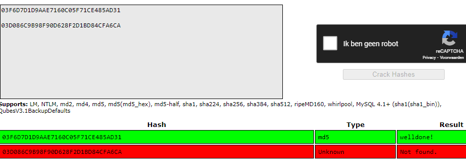
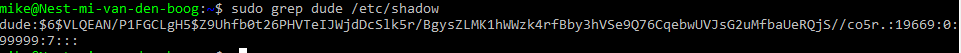
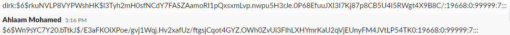

# [Passwords]
Leg uit wat hashing is en waarom hashing wordt gebruikt bij het opslaan van wachtwoorden in plaats van symmetric encryption.
Probeer met behulp van een rainbow table de volgende hashes te kraken:
- 03F6D7D1D9AAE7160C05F71CE485AD31
- 03D086C9B98F90D628F2D1BD84CFA6CA
Voeg een nieuwe gebruiker toe aan je vm en geef deze gebruiker het wachtwoord 12345. Vergelijk de hash van dit wachtwoord met die van een groepsgenoot 

## Key-terms
- hashing
- collision
- digital signature
- salt

## Opdracht
### Gebruikte bronnen
- [Rainbow table attack uitleg](https://www.geeksforgeeks.org/understanding-rainbow-table-attack/)
- [Hashing](https://www.techtarget.com/searchdatamanagement/definition/hashing)
- [Rainbowtable uitleg](https://www.beyondidentity.com/glossary/rainbow-table-attack)
- [Hashing vs symmetricEncryption](https://www.encryptionconsulting.com/education-center/encryption-vs-hashing/)
- [Salt](https://auth0.com/blog/adding-salt-to-hashing-a-better-way-to-store-passwords/)

### Ervaren problemen
[Geef een korte beschrijving van de problemen waar je tegenaan bent gelopen met je gevonden oplossing.]

### Resultaat
Hashing:
Hashing uses functions or algorithms to map object data to a representative integer value. A hash can then be used to narrow down searches when locating these items on that object data map. 
In the data security field, encryption and hashing are commonly compared, but why is this the case. Encryption is a two-way function where data is passed in as plaintext and comes out as ciphertext, which is unreadable. Since encryption is two-way, the data can be decrypted so it is readable again. Hashing, on the other hand, is one-way, meaning the plaintext is scrambled into a unique digest, through the use of a salt, that cannot be decrypted. Technically, hashing can be reversed, but the computational power needed to decrypt it makes decryption infeasible.

Rainbow Table:
A rainbow table attack is a password cracking method that uses a special table (a “rainbow table”) to crack the password hashes in a database. Applications don’t store passwords in plaintext, but instead encrypt passwords using hashes. After the user enters their password to login, it is converted to hashes, and the result is compared with the stored hashes on the server to look for a match. If they match, the user is authenticated and able to login to the application. 

Rainbow Table Hashes:    

Compare Hashes:
My hash: 

    $6$VLQEAN/P1FGCLgH5$Z9Uhfb0t26PHVTeIJWjdDcSlk5r/BgysZLMK1hWWzk4rfBby3hVSe9Q76CqebwUVJsG2uMfbaUeRQjS
Group hash1:

    $6$rkuNVLP8VYPWshHK$l3Tyh2mH0sfNCdY7FASZAamoRI1pQxsxmLvp.nwpu5H3rJe.0P68EfuuJXI3I7Kj87p8CB5U4I5RWgt4X9B8C
group hash2:

    $6$Wn9sYC7Y20.bTtkJ$/E3aFKOiXPoe/gvj1Wqj.Hv2xafUz/ftgsjCqot4GYZ.OWh0ZvUi3FIhLXHYmrKaU2qVjEUnyFM4JVtLP54TK0

Hash group:

Both hashes start with $6$, rest is different.