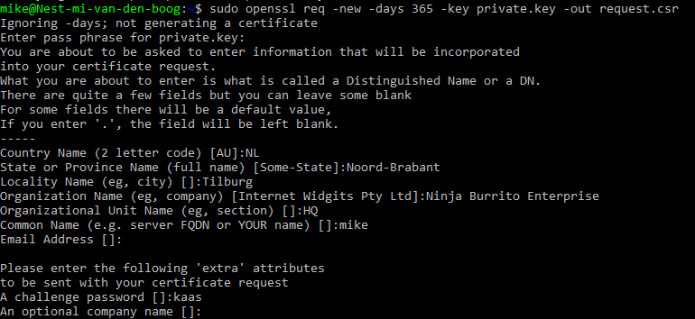

# [Public Key Infrastructure]
Maak een self-signed certificaat voor je vm. 
Analyseer een paar certification paths van webpagina's (bvb. techgrounds.nl / google.com / ing.nl)
Vindt de trusted certificate roots op je pc. Bonus punten als je dit op je vm gevonden krijgt.

## Key-terms
- Pki : client, server, ca(certificate authority)

## Opdracht
### Gebruikte bronnen
- [YT Sunny Uitleg](https://www.youtube.com/watch?v=LPxeYtMDxl0)
- [Linux self-signed certificate How2](https://www.arubacloud.com/tutorial/how-to-create-a-self-signed-ssl-certificate-on-ubuntu-18-04.aspx)
- [self-signed certificate > commands explained](https://www.digitalocean.com/community/tutorials/how-to-create-a-self-signed-ssl-certificate-for-apache-in-ubuntu-22-04)
- [certificate check](https://support.nmi.com/hc/en-gb/articles/360021544791-How-to-Check-If-the-Correct-Certificates-Are-Installed-on-Linux)
- [certification paths](https://www.coursera.org/articles/it-certification-roadmap-a-guide)
- [Trusted Certificate location windows](https://www.encryptionconsulting.com/digital-certificate-and-windows-certificate-stores/)
- [Certificate loc Linux](ubuntu.com/server/docs/security-certificates)

### Ervaren problemen
[Geef een korte beschrijving van de problemen waar je tegenaan bent gelopen met je gevonden oplossing.]

### Resultaat ###

#### Certificaat
Key aangemaakt met passphrase "kaas".  

    sudo openssl genrsa -aes128 -out private.key 2048

    sudo openssl req -new -days 365 -key private.key -out request.csr

    sudo openssl x509 -in request.csr -out certificate.crt -req -signkey private.key -days 365

Controle of het certificaat is aangemaakt.

### Analyse certificaten ###

### Trusted certificate locatie ###

De locatie van de trusted certificate roots op je pc vindt je met behulp van het programma "console1". Hier voeg je het kopje certificaten toe.

Locatie trusted certificate: /etc/ssl/certs 

