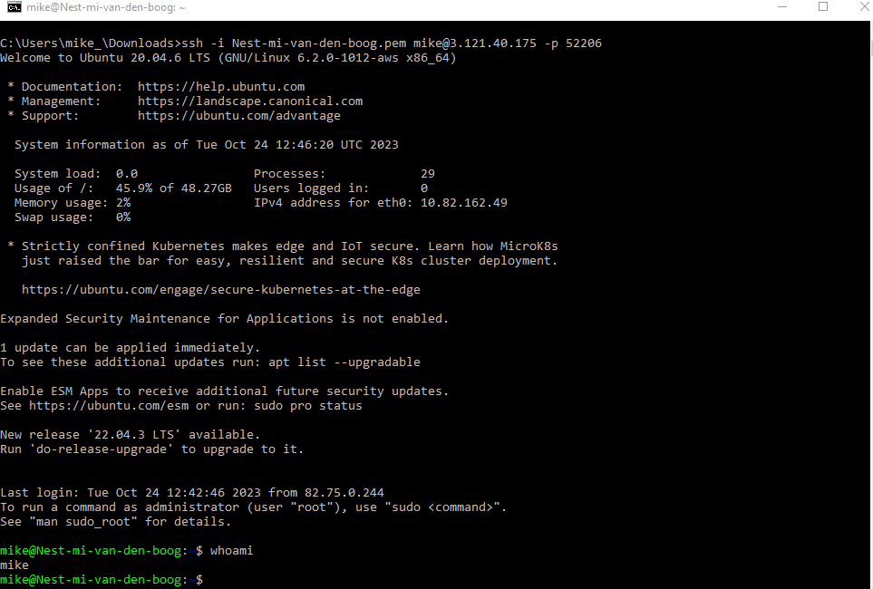

# [Setting Up]
Een verbinding maken met de virtual machine, met gebruik van een ssh key. 
Zodra er verbinding is, testen met "whoami" command in terminal.

## Key-terms
- SSH (beveiligings protocol)
- Virtual Machine 
- Putty (vm software)

## Opdracht
### Gebruikte bronnen
- [stappenplan](https://www.clickittech.com/aws/connect-ec2-instance-using-ssh/)

### Ervaren problemen
Tijdens het zoeken naar informatie veel gelijksoortige oplossingen gevonden die heel erg op elkaar leken, maar toch net iets verschillend waren. 
Opgelost door de verschillende oplossingen door te lezen en uit te proberen

### Resultaat
cmd prompt:   

    cd downloads\
    ssh -i Nest-mi-van-den-boog.pem mike@3.121.40.175 -p 52206

Putty: ip + poort invoeren > auth > ssh key uploaden > run (connect2vm)

Login + 'whoami'

