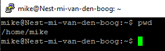
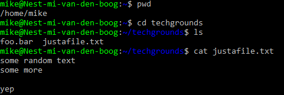
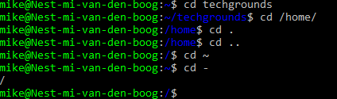

# [Files & Directories]
Vind uit welke directory er beschikbaar is op de virtual machine. Maak vervolgens een lijst van alle bestanden en mappen van /home/
Maak een nieuw folder aan met de naam "techgrounds" en maak een bestand in dit folder met wat tekst erin.
navigeer door je directory door middel van absolute en relative paths.
 
## Key-terms
- Directories (linux folders)
- pwd
- cat
- cd

## Opdracht
### Gebruikte bronnen

[ Command cheatsheet Linux](https://www.hostinger.com/tutorials/linux-commands)
[create file + text](https://www.cyberciti.biz/faq/create-a-file-in-linux-using-the-bash-shell-terminal)

### Ervaren problemen
[Geef een korte beschrijving van de problemen waar je tegenaan bent gelopen met je gevonden oplossing.]

### Resultaat

    $ pwd

    $ mkdir techgrounds

Nieuw file met tekst

Absolute & Relative paths

    $ cd ~ (go to home)
    $ cd - (go to previous)
    $ cd /path/path/path (absolute > go strictly there)
    $ cd ../path (relative > up and somewhere matching)

