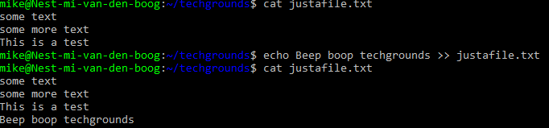
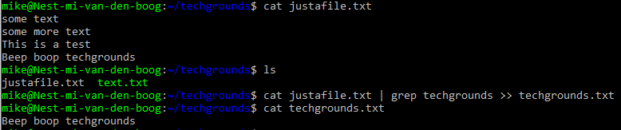

# [Working with text (CLI)]
1. via echo command + output redirection nieuwe regel met "Techgrounds" toevoegen aan bestand
2. write text file naar terminal
3. read file with command step 2 > filter techgrounds > redirect output naar nieuw bestand genaamd "techgrounds.txt"

## Key-terms
- GUI (graphical user interface)
- CLI (Command line interface)
- echo
- pipe

## Opdracht
### Gebruikte bronnen
- [Pipe](https://www.geeksforgeeks.org/piping-in-unix-or-linux/)
- Linux cheatsheet

### Ervaren problemen

### Resultaat
regel tekst naar file + print terminal

filter op techgrounds en schrijf regel naar nieuw .txt

