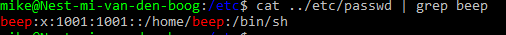

# [Users & Groups]
1. maak een nieuwe gebruiker. deze gebruiker moet bij de admin group horen, heeft een wachtwoord en heeft rechten om "sudo" te gebruiken
2. Lokaliseer waar de bestanden staan met daarin users, passwords en groups. Vind hierin de nieuw toegevoegde gebruiker.

## Key-terms
- sudo
- adduser (!useradd doet ongeveer hetzelfde maar met minder functies!)

## Opdracht
### Gebruikte bronnen
[sudo](https://phoenixnap.com/kb/linux-sudo-command)

[adduser](https://www.howtogeek.com/50787/add-a-user-to-a-group-or-second-group-on-linux/)

### Ervaren problemen
Bij toevoegen van user geen extra info opties, die hier wel zouden zijn.
Oplossing: useradd doet hetzelfde als adduser maar zonder extra gegevens nodig. *adduser gebruiker ipv useradd

### Resultaat
toevoegen user:

    sudo adduser beep

add groups  

user 

user groups 

user username   

user password

