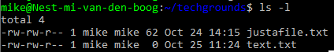
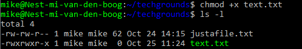
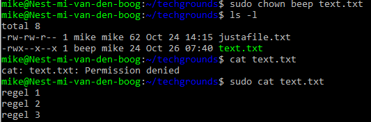
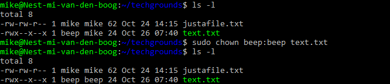

# [File & Permissions]
1. maak een nieuw tekstbestand
2. laat hiervan toegankelijkheids informatie zien (rechten, bestands eigenaar, group etc.)
3. maak een uitvoerbaar bestand door execute permission (x) toe te voegen.
4. verwijder de read en write toegang van het bestand voor de group en andere gebruikers, niet de owner. Kan de eigenaar het bestand nog steeds lezen? 
5. verander de eigenaar van het bestand naar een andere gebruiker > orginele eigenaar kan het bestand niet lezen zonder "sudo".
6. verander de groups ownership van het bestand naar een andere groep.

## Key-terms
- long listing
- chmod
- chown
- rwx - "read" "write" "executable"
 - ugo - permission "user" "groups" "others" 

## Opdracht
### Gebruikte bronnen
- [File permission basics](https://www.redhat.com/sysadmin/linux-file-permissions-explained)
- [File permission extra](https://www.pluralsight.com/blog/it-ops/linux-file-permissions)

### Ervaren problemen
[Geef een korte beschrijving van de problemen waar je tegenaan bent gelopen met je gevonden oplossing.]

### Resultaat

Show longlisting    

Change file to executeable + run  

change file owner    

change file group owner 

