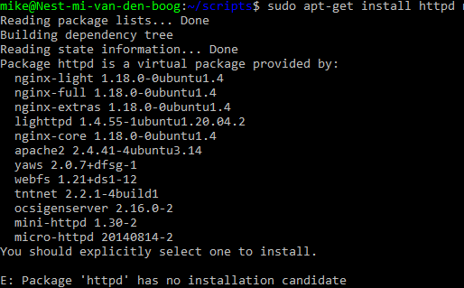

# [Processes]
Start het telnet daemon. Achterhaal het process id (PID) en hoeveel geheugen er gebruikt wordt door het telnet daemon. Stop hierna het telnet daemon process.

## Key-terms
-Daemons > runs in background, non-interactive
-Services > respond/requests from programs, interactive
-Programs > run and used by users
-Process > instance of running code
-PID
-top/htop > Memory usage / extended memuse

## Opdracht
### Gebruikte bronnen
- [commands for memuse check](https://phoenixnap.com/kb/linux-commands-check-memory-usage)
- ['kill'process](https://www.cyberciti.biz/faq/how-force-kill-process-linux/) 

### Ervaren problemen

Aan het begin van de opdracht lukte het maar niet om telnet te openen, veel opgezocht zonder resultaat. door een tip van een groepsgenoot erachter gekomen dat telnet opstart door telnet te typen

### Resultaat
datause telnet + id

telnet id   

telnet stopped
