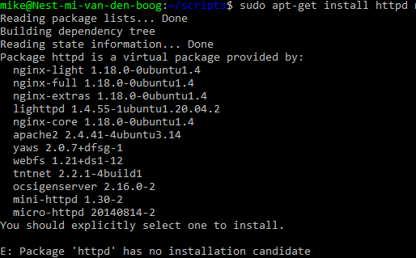

# [Onderwerp]
[Geef een korte beschrijving van het onderwerp]

## Key-terms
-$PATH > "The $PATH environmental variable is a colon-delimited list of directories that tells the shell which directories to search for executable files."
-script
-bash

## Opdracht
### Gebruikte bronnen

[PATH](https://phoenixnap.com/kb/linux-add-to-path#:~:text=PATH%20is%20an%20environment%20variable,command%20without%20specifying%20a%20path.)
[VIMSaveExit](https://www.cyberciti.biz/faq/linux-unix-vim-save-and-quit-command/)

[Apache2Install](https://mkyong.com/apache/how-to-install-apache-http-server-in-ubuntu/)

[Apache2Extrainfo](https://www.cyberciti.biz/faq/linux-install-and-start-apache-httpd/)

[ServiceStatus](https://www.cyberciti.biz/faq/systemd-systemctl-view-status-of-a-service-on-linux/)

### Ervaren problemen
bij het installeren van httpd kwam deze melding
 [oplossing](https://stackoverflow.com/questions/26865161/unable-to-install-httpd-on-digitalocean) Toelichting: Ubuntu beschikt over httpd onderdelen maar biedt deze al als kant en klaar pakket aan, dus ipv httpd download je apache2 (één van de meest gebruikte server package )

Tijdens de installatie die door het script word aangeroepen komt er een y/n invoer moment, waardoor het script onderbroken word. Oplossing: -y bij de installatie toevoegen, dit zorgt ervoor dat alle mogelijke vragen met yes beantwoord worden.

### Resultaat
[Omschrijf hoe je weet dat je opdracht gelukt is (gebruik screenshots waar nodig).]
