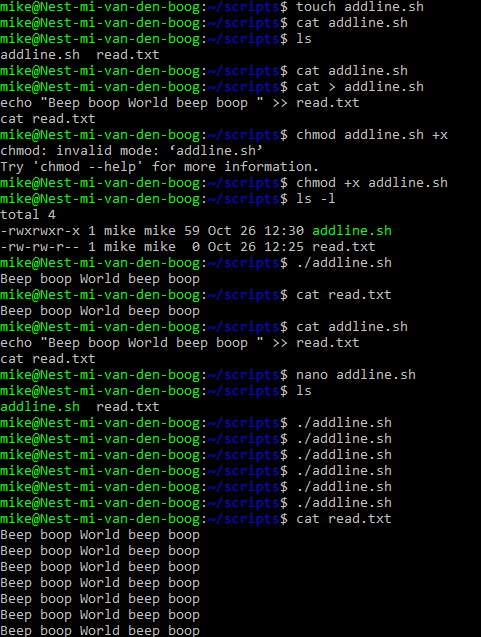
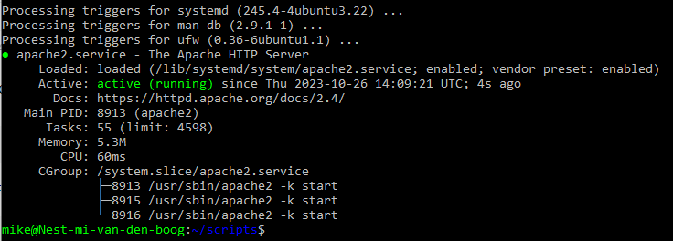
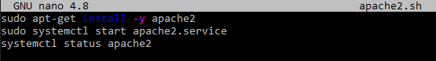
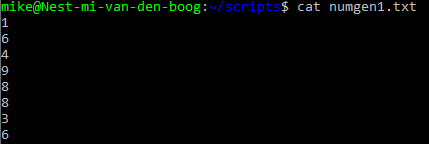
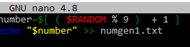
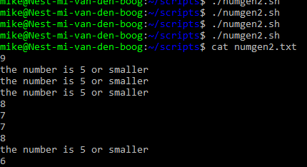
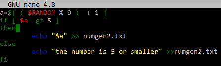

# [Onderwerp]

## Key-terms
- $PATH > "The $PATH environmental variable is a colon-delimited list of directories that tells the shell which directories to search for executable files."
- bash
- apt-get

## Opdracht
### Gebruikte bronnen

- [PATH](https://phoenixnap.com/kb/linux-add-to-path#:~:text=PATH%20is%20an%20environment%20variable,command%20without%20specifying%20a%20path.)
- [VIM Save Exit](https://www.cyberciti.biz/faq/linux-unix-vim-save-and-quit-command/)

- [Apache2 Install](https://mkyong.com/apache/how-to-install-apache-http-server-in-ubuntu/)

- [Apache2 Extrainfo](https://www.cyberciti.biz/faq/linux-install-and-start-apache-httpd/)

- [yesno in scripts](https://askubuntu.com/questions/805067/is-there-a-way-to-force-yes-to-any-prompts-when-installing-from-apt-get-from)

- [Service Status](https://www.cyberciti.biz/faq/systemd-systemctl-view-status-of-a-service-on-linux/)

- [Random](https://www.baeldung.com/linux/random-numbers)

- [If Elif Else](https://www.tutorialspoint.com/unix/if-elif-statement.htm)

- [bash Cheatsheet](https://devhints.io/bash)

### Ervaren problemen
bij het installeren van httpd kwam deze melding 
 

[oplossing](https://stackoverflow.com/questions/26865161/unable-to-install-httpd-on-digitalocean) Toelichting: Ubuntu beschikt over httpd onderdelen maar biedt deze al als kant en klaar pakket aan, dus ipv httpd download je apache2 (één van de meest gebruikte server package )

Tijdens de installatie die door het script word aangeroepen komt er een y/n invoer moment, waardoor het script onderbroken word. Oplossing: -y bij de installatie toevoegen, dit zorgt ervoor dat alle mogelijke vragen met yes beantwoord worden.

### Resultaat

addline script + run    

result installscript    
 

install script  
 

random number generator 1   
 

script numgen1  

random number generator 2   
 

script numgen2  
 

