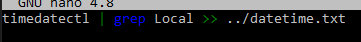

# [CronJobs]
maak een bashscript dat de huidige tijd naar een bestand schrijft.
laat dit script elk minuut draaien met een cronjob
maak een script dat de beschikbare ruimte naar een logfile schrijft in /var/logs. gebruik een cronjob om dit elke week te doen.

## Key-terms
- cronjob
- timedatectl

## Opdracht
### Gebruikte bronnen
- [cron jobs](https://www.freecodecamp.org/news/cron-jobs-in-linux/)

- [cronjobs2](https://www.digitalocean.com/community/tutorials/how-to-use-cron-to-automate-tasks-ubuntu-1804)

[Plaats hier de bronnen die je hebt gebruikt.]

### Ervaren problemen
krijg cronjob niet werkend.

### Resultaat

script
