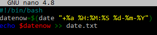
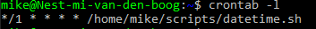
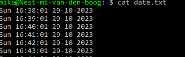
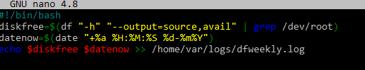
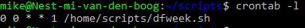

# [CronJobs]
maak een bashscript dat de huidige tijd naar een bestand schrijft.
laat dit script elk minuut draaien met een cronjob
maak een script dat de beschikbare ruimte naar een logfile schrijft in /var/logs. gebruik een cronjob om dit elke week te doen.

## Key-terms
- cronjob
- timedatectl

## Opdracht
### Gebruikte bronnen
- [cron jobs](https://www.freecodecamp.org/news/cron-jobs-in-linux/)

- [cronjobs2](https://www.digitalocean.com/community/tutorials/how-to-use-cron-to-automate-tasks-ubuntu-1804)
- [date command](https://phoenixnap.com/kb/linux-date-command)
- [date format](https://askubuntu.com/questions/634173/how-to-get-date-and-time-using-command-line-interface)
- [diskFree df](https://www.cyberciti.biz/faq/df-command-examples-in-linux-unix/)

### Ervaren problemen
bashscript niet werkend via cronjob. Permission denied etc
Oplossing, rechten stonden goed. $date moest gebruikt worden ipv timedatectl 

### Resultaat

script  

cronjob  

cronjob result  

disk free weekly script     

disk free weekly cronjob    
