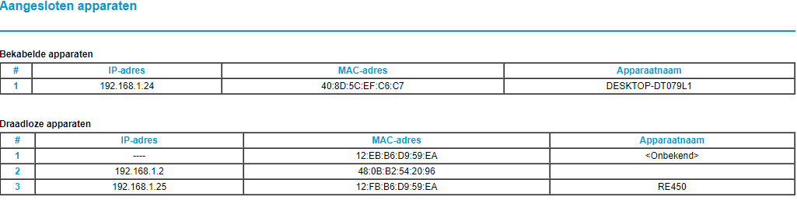
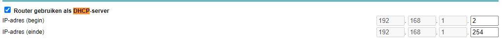

# [NetworkingDevices]
Maak een lijst van veelvoorkomende netwerkapparatuur en benoem en beschrijf de functies hiervan.
Vindt de lijst met alle verbonden apparaten in de router, licht kort toe welke andere informatie de router over de aangesloten apparatuur heeft.
Als laatste onderdeel van deze opdracht laat je zien waar de DHCP server van mijn netwerk staat en wat de configuraties hiervan zijn.

## Key-terms
[Schrijf hier een lijst met belangrijke termen met eventueel een korte uitleg.]

## Opdracht
### Gebruikte bronnen
- [NetwerkApparatuur](https://www.lepide.com/blog/the-most-common-types-of-network-devices/)
- [MAC-adres](https://www.techtarget.com/searchnetworking/definition/MAC-address#:~:text=How%20to%20find%20the%20MAC,and%20status%20of%20the%20device.)

### Ervaren problemen
[Geef een korte beschrijving van de problemen waar je tegenaan bent gelopen met je gevonden oplossing.]

### Uitwerking opdrachten

### Netwerk apparatuur
Veel voorkomende netwerk apparatuur:

**Hubs**    
 Apparaat om computers en randapparatuur (zoals uw printer) met een netwerk te verbinden. De hub is het middelpunt van het netwerk. Wanneer een computer iets uitzendt (bijvoorbeeld een printopdracht), dan zorgt de hub ervoor dat de informatie doorgestuurd wordt naar alle andere apparaten. Een apparaat dat hiervoor in de plaats is gekomen en zijn werk sneller doet is de switch.

**Switch**  
Een apparaat om binnen één netwerk meerdere apparaten, zoals computer(s) en netwerkprinter(s) met elkaar te verbinden. Meestal kunt u met een switch 4 tot 5 apparaten met elkaar verbinden. De switch is een vervanging van de hub. De switch werkt sneller dan een hub, omdat de switch onder andere selecteert naar welk apparaat een signaal doorgestuurd moet worden. Een hub stuurt het signaal naar alle apparaten die met elkaar verbonden zijn.

**Router**  
Vaak gecombineerd met een modem. Dat zorgt voor een werkende internetverbinding, terwijl de router het verkeer regelt tussen het internet en uw aangesloten elektronische apparaten. De router maakt het mogelijk dat meerdere apparaten tegelijk op internet actief zijn en dat de verschillende stromen gegevens op de goede plek aankomen. Dat gebeurt steeds vaker draadloos via een wifi-verbinding.

**Modem**   
Samentrekking van 'modulator' en 'demodulator'. Een apparaat om verbinding te maken met internet.

**Bridge**  
Apparatuur dat gebruikt wordt om netwerk onderdelen of hosts met elkaar te verbinden. Met dit apparaat kan een groot netwerk in kleinere delen opgesplitst worden. Ook kan de bridge bepaalde datapakketen filteren, bekend als frames, voor ze worden door gestuurd. Bridges zijn in populariteit aan het afnemen en worden vervangen door switches.

**Gateway** 
Een gateway wordt gebruikt als communicatiemiddel tussen OSI en TCP/IP

**Repeater**    
Dit apparaat versterkt het signaal zodat deze een langere afstand kan bereiken. Repeaters werken op de Physical layer van het OSI model.

**Access Point** 
 Een Access Point (AP) lijkt op een router maar heeft een ingebouwde antenne, adapter en "transmitter". Denk een aan wifi-extender. 

 ### Verbonden apparaten router
  

  Deze lijst met verbonden apparatuur is onderverdeeld in bekabelde en draadloze apparaten.
  De extra informatie die zichtbaar zijn, betekenen het volgende: 
  - IP-adres    
  Het IP adress van het aangesloten apparaat ("online-id" van apparaat)
  
  - MAC-adres   
  Betekend: "media access control address". Dit is een id-nummer wat door het netwerk wordt toegekent aan een apparatuur, zodat deze kunnen communiceren.

  - Apparaatnaam    
  Naam van het apparaat die de gebruiker/fabrikant heeft ingesteld.

  ### DHCP server
  De DHCP server op mijn netwerk staat in de map "LAN instellen" onder Geavanceerd. Het begin en eind ip kan worden ingesteld.     
  