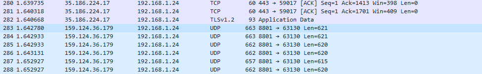

# [Protocols]
Maak een lijst met daarin protocols die gebruikt worden per OSI laag. Geef ook een korte toelichting door wie de protocollen bedacht zijn en wat je moet doen om zelf een protocol te openbaar te maken.
Gebruik Wireshark om je eigen netwerk data te bekijken. Capture een aantal regels en leg het gebruikte protocol uit.

## Key-terms
- Protocol

## Opdracht
### Gebruikte bronnen
- "diepere" informatie OSI lagen >> zie extra info bij uitwerkingen
- [wiki begin protocols](https://en.wikipedia.org/wiki/OSI_protocols#Routing_protocols)

### Ervaren problemen
nvt.

### Uitwerking opdrachten

### Protocols en OSI
Het OSI is opgebouwd uit 7 lagen. Elke laag heeft meerdere protocols waar gebruik van gemaakt kan worden. Hieronder een lijstje met een aantal protocols per laag. (Weergeven vanaf boven naar onder >> Physical is de onderste laag en Application is de bovenste laag )

**Application Layer** [Extra info](https://www.geeksforgeeks.org/application-layer-in-osi-model/?ref=lbp)
- Telecommunications Network (TELNET)
- Domain Name System (DNS)
- Dynamic Host Configuration Protocol (DHCP)
- File Transfer Protocol (FTP)
- Simple Mail Transfer Protocol (SMTP)
- Hyper Text Transfer Protocol (HTTP)
- Network File System (NFS)
- Simple Network Management Protocol (SNMP)

**Presentation Layer** [Extra info](https://www.geeksforgeeks.org/presentation-layer-in-osi-model/)
- Apple Filing Protocol (AFP)
- Lightweight Presentation Protocol (LPP)
- NetWare Core Protocol (NCP)
- Network Data Representation (NDR)
- External Data Representation (XDR)
- Secure Socket Layer (SSL)

**Session Layer** [Extra info](https://www.geeksforgeeks.org/session-layer-in-osi-model/?ref=lbp)
- AppleTalk Data Stream Protocol (ADSP)
- Real-time Transport Control Protocol (RTCP)
- Point-to-Point Tunneling Protocol (PPTP)
- Password Authentication Protocol (PAP)
- Remote Procedure Call Protocol (RPCP)
- Sockets Direct Protocol (SDP)

**Transport Layer** [Extra info](https://www.geeksforgeeks.org/transport-layer-responsibilities/)
- Transmission Control Protocol (TCP)
- User Datagram Protocol (UDP)
- Stream Control Transmission Protocol (SCTP)
- Datagram Congestion Control Protocol (DCCP)
- AppleTalk Transaction Protocol (ATP)
- Fibre Channel Protocol (FCP)
- Reliable Data Protocol (RDP)
- Reliable User Data Protocol (RUDP)
- Structured Steam Transport (SST)
- Sequenced Packet Exchange (SPX)

**Network Layer** [Extra info](https://www.geeksforgeeks.org/difference-between-network-layer-protocols-and-application-layer-protocols/)
- Internet Protocol (IP)
- Internet Control Message Protocol (ICMP)
- Address Resolution Protocol (ARP)
- Routing Information Protocol (RIP)
- Open Shortest Path First (OSPF)

**Data Link Layer** *[Extra info](https://www.geeksforgeeks.org/data-link-layer/?ref=lbp)*
- Synchronous Data Link Protocol (SDLC)
- High-Level Data Link Protocol (HDLC)
- Serial Line Interface Protocol (SLIP)for encoding
- Point to Point Protocol (PPP)
- Link Access Procedure (LAP)
- Link Control Protocol (LCP)
- Network Control Protocol (NCP)

**Physical Layer** *[Extra info](https://www.geeksforgeeks.org/physical-layer-in-osi-model/?ref=lbp)*
- Ethernet with 1000BASE-T
- Ethernet with 1000BASE-SX
- Ethernet at 100BaseT
- Synchronous Digital Hierarchy/Optical Synchronisation
- Physical-layer variations in 802.11
- Bluetooth
- Networking for controllers
- U.S. Serial Bus

### Protocol Bosses 
The Open Systems Interconnection protocols are a family of information exchange standards developed jointly by the ISO and the ITU-T. The standardization process began in 1977.

### Wireshark Own Network
Netwerk data van mijn eigen netwerk

*UDP protocol*: User datagram protocol
Dit protocol maakt een process-to-process communicatie mogelijk. Het protocol is actief in de transportlaag. Over het algemeen wordt TCP gebruikt voor de meeste internet services. TCP levert een aantal services waar UDP niet over beschikt, door deze services wordt de "latency" zwaarder belast. Wat kan resulteren in een tragere data overdracht. In dit geval wordt UDP gebruikt. Voor real-time services zoals computer gaming, video of spraak communicatie. UDP is hiervoor nodig omdat bij deze services hoge preformance belangrijk is. (Videocall met happerend beeld door een langzame data overdracht is niet wenselijk.)
