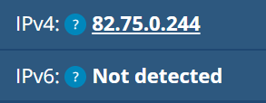
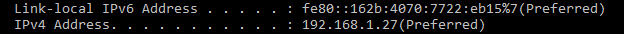
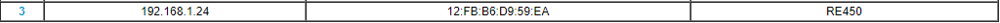

# [IP adressing]
Achterhaal het publieke en privé IP adres van je pc en mobiel op wifi. Leg hierbij uit waarom de adressen hetzelfde zijn of waarom ze verschillen van elkaar.
Verander het privé IP adres van je mobiel naar dat van je laptop en leg uit wat er dan gebeurd. 
Probeer vervolgens het privé IP adres van je mobiel te veranderen naar een adres buiten je netwerk en leg uit wat er dan gebeurd.

## Key-terms
- private IP
- public IP
- IPv4
- IPv6 (Hexadecimal notatie)
- Public en private IP
- NAT
- Statische en dynamische adressen

## Opdracht
### Gebruikte bronnen
- [IP:Public vs Private](https://www.scaler.com/topics/computer-network/public-and-private-ip-address/)
- [WhatismyIP?](https://whatismyipaddress.com/)
### Ervaren problemen
[Geef een korte beschrijving van de problemen waar je tegenaan bent gelopen met je gevonden oplossing.]

### Resultaat
Publiec IPv4 pc:   

Publiec IPv6 pc:

Public IP mobiel:

Publieke IP adressen van apparaten zijn vergelijkbaar met een BSN. Elk IP moet uniek zijn zodat het duidelijk is welk apparaat er daadwerkelijk verbindt.

Private IP PC   

Private IP mobiel:

Private IP's beginnen altijd met 192.168.1. Het getal wat na de "1." komt is het apparaat nummer binnen het netwerk, in het geval van mijn pc is dit 27. 

IP mobiel veranderd van 192.168.1.10 naar 192.168.1.24. Hierdoor krijgt de telefoon een "nieuw" lokaal ip met nummer 24 

Zodra je het ip van je mobiel veranderd naar een ip buiten je netwerk valt de wifi weg. De telefoon kan nog wel verbinden met de router maar zonder internetverbinding. Bij huidige netwerken komt een melding bij het netwerk te staan dat er geen internetverbinding mogelijk is.