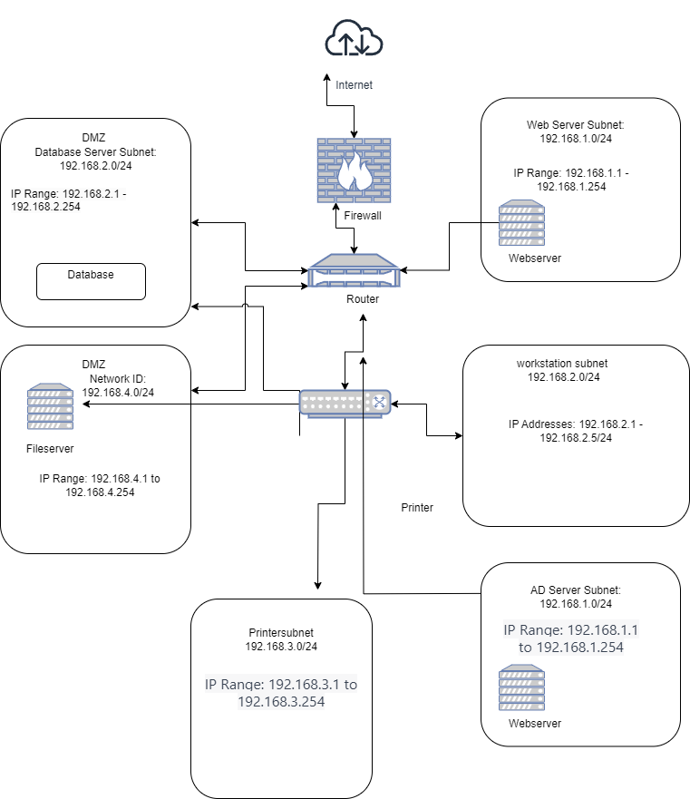

# [Networkign Case study]
maak een netwerk achitectuur aan de hand van een case study van een nieuw kantoor van een klein e-commerce bedrijf. Netwerk beveiliging is extreem belangrijk voor dit bedrijf.
De volgende apparaten zijn onderdeel van het kantoor netwerk:
- A web server where our webshop is hosted
- A database with login credentials for users on the webshop
- 5 workstations for the office workers
- A printer
- An AD server
- A file server containing internal documents

## Key-terms
[Schrijf hier een lijst met belangrijke termen met eventueel een korte uitleg.]

## Opdracht
### Gebruikte bronnen
- [CIDR tool](https://app.diagrams.net/)

### Ervaren problemen
Heel de opdracht.. vanalles aan het doen maar geen idee waarom. Extra hulp gevraagd zonder succes

### Resultaat
fout antwoord:

Goede antwoord: succes ermee!