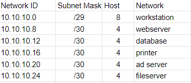

# [Networkign Case study]
maak een netwerk achitectuur aan de hand van een case study van een nieuw kantoor van een klein e-commerce bedrijf. Netwerk beveiliging is extreem belangrijk voor dit bedrijf.
De volgende apparaten zijn onderdeel van het kantoor netwerk:
- A web server where our webshop is hosted
- A database with login credentials for users on the webshop
- 5 workstations for the office workers
- A printer
- An AD server
- A file server containing internal documents

## Key-terms
- VLSM = Variable Length Subnet Mask

## Opdracht
### Gebruikte bronnen
- [CIDR tool](https://app.diagrams.net/)
- [YT Uitleg Sunny CIDR reeks](https://www.youtube.com/watch?v=ecCuyq-Wprc) S TIER UITLEG: 5 filmpjes met uitleg over CIDR en VLSM 
- [VLSM](https://www.techtarget.com/searchnetworking/definition/variable-length-subnet-mask)
- [YT uitleg CIDR ander kanaal](https://www.youtube.com/watch?v=BWZ-MHIhqjM&list=PLIFyRwBY_4bQUE4IB5c4VPRyDoLgOdExE)

### Ervaren problemen
Eerste uitwerking:  
   
Zelfde probleem als bij subnetting, uiteindelijk opgelost door veel verschillende bronnen/uitleg te volgen.

### Resultaat
Fout a
Subnet groepen:     
  

Diagram van de case study
 

Het netwerk begint bij het punt waar het internet binnen komt bij de ISP modem. Vervolgens zit hier een firewall achter om naar de eerst volgende router te komen. Deze router heeft een verbinding met een DMZ waarin de webserver en de AD server actief zijn. De ander verbinding vanaf deze router gaat richting de 2de firewall, ook wel de interne firewall om vervolgens naar interne router te gaan. Vanuit deze router ligt er een verbinding naar een 2de DMZ waarin een database en een fileserver zitten. Daarnaast zit er een verbinding naar de workstations (5 stuks) van het bedrijf en een verbinding naar de switch waarmee gecommuniceerd kan worden met zowel de printer als met de database en de file server.