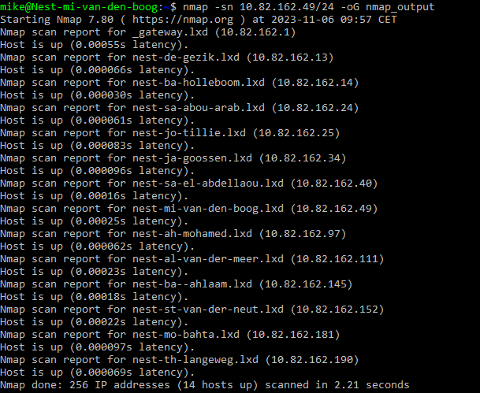
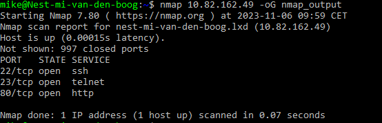
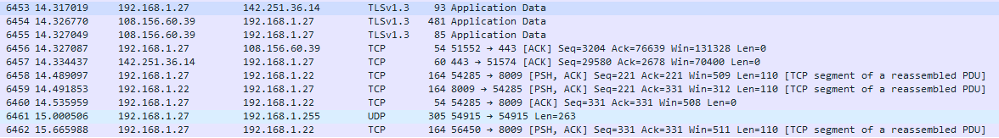

# [Network Detection]
Scan het netwerk van je linux machine door middel van nmap en laat de resultaten hiervan zien.
Open wireshark en analiseer wat er gebeurd als je een webbrowser opent.

## Key-terms
- Nmap (Network Mapper)

## Opdracht
### Gebruikte bronnen
- [Nmap commands](https://www.redhat.com/sysadmin/quick-nmap-inventory)

### Ervaren problemen
[Geef een korte beschrijving van de problemen waar je tegenaan bent gelopen met je gevonden oplossing.]

### Resultaat
Nmap scan full network  

    nmap -sn 10.82.162.49 -oG nmap_output   

 

nmap scan my network    

    nmap -sn 10.82.162.49 -oG nmap_output   

    

Wireshark pakketen na openen browser:   

