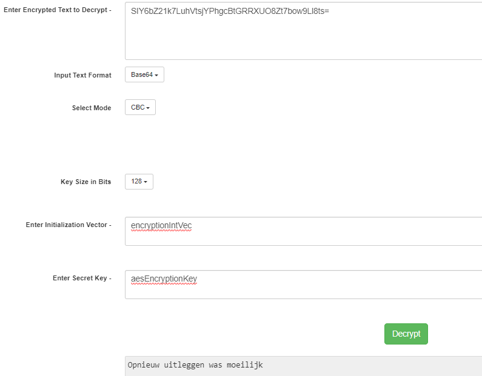

# [Symmetric Enryption]
Benoem een aantal historische cipher naast Ceasar cipher.
Benoem twee digitale ciphers die nog gebruikt worden.

## Key-terms
- Cryptography = Art of making a cryptosystem
- Cryptanalysis = Art of breaking a cipher text
- Symmetric encryption = "private key encryption" 1 key for sender and reciever
- Asymmetric encryption = Public/private key

## Opdracht
### Gebruikte bronnen
- [Cryptography](https://www.fortinet.com/resources/cyberglossary/what-is-cryptography)
- [YT Symmetric vs Asymmetric](https://www.youtube.com/watch?v=nRou-J4YN4Y)
- [Cypher uitleg](https://www.techtarget.com/searchsecurity/definition/cipher)
- [Historic Ciphers](https://interestingengineering.com/innovation/11-cryptographic-methods-that-marked-history-from-the-caesar-cipher-to-enigma-code-and-beyond)

- [Modern Ciphers](https://www.math.stonybrook.edu/~scott/papers/Book331/Modern_cryptography.html)
- [RSA](https://www.encryptionconsulting.com/education-center/what-is-rsa/)
- [Rsa Tool](https://www.javainuse.com/rsagenerator)
- [AES Tool](https://www.javainuse.com/aesgenerator)
- [YT Sunny Uitleg](https://www.youtube.com/watch?v=vk3py9M2IfE&list=PLSNNzog5eyduN6o4e6AKFHekbH5-37BdV&index=1&t=0s) 9 filmpjes over basic cryptography

### Ervaren problemen

### Resultaat
#### Historic Ciphers:  
**Atbash**: This cipher is a substitution cipher in which the plaintext alphabet is mapped onto itself but in reverse order. In other words, the plaintext letter A is mapped to ciphertext Z, B is mapped to Y, C to X and so on. Atbash is named after the two first and two last letters in the Hebrew alphabet. It is thought to have been in use for hundreds of years.

**Simple substitution**: This one has also been used for hundreds of years. It substitutes every plaintext character for a different ciphertext character, resulting in what is effectively a 26-character key. It differs from the Caesar cipher because the enciphering alphabet is completely jumbled, rather than simply shifted a uniform number of places.

**Vigenère**: This cipher is a form of polyalphabetic substitution, meaning it is based on substitution using multiple substitution alphabets. The Vigenère cipher uses a series of interwoven Caesar ciphers, based on the letters of a keyword. The original text is encrypted using what is known as the Vigenère square or Vigenère table.

**Homophonic substitution**: This substitution cipher uses several different ciphertext letters to replace single plaintext letters. This type of cipher is typically much more difficult to break than standard substitution ciphers.

#### Modern Ciphers:
**RC4**: Rivest Cipher 4 (RC$) is a symmetric encryption which is most commonly used of all stream ciphers
**RSA**: The Rivest-Shamir-Adleman (RSA) encryption algorithm is an asymmetric encryption algorithm that is widely used in many products and services. Asymmetric encryption uses a key pair that is mathematically linked to encrypt and decrypt data. A private and public key are created, with the public key being accessible to anyone and the private key being a secret known only by the key pair creator. With RSA, either the private or public key can encrypt the data, while the other key decrypts it.

**DES**: the Data Encryption Standard (DES) The standard implementation of DES operates on 64-bit blocks (that is, it uses an alphabet of length 264-- each ``character'' is 8 bytes long), and uses a 56-bit key. 

**IDEA**: International Data Encryption Algorithm (IDEA)

Asymmetric encrypted bericht:   

    Deel 1: V+Hq89dvlinQYM591vzoX/G2nd7vdREDCMGK+ShXQw5z9+/jZtYyJ3E/zNdkNBls4nntPX9zbWAFQFKwrIMjsA==
    Deel 2: bntEjaebUfZq5my2vcjcbNW26ZsGkkYP6X8q6l/NVgoRwlE7mBM9TENwWKvZ7JKV80qmvYftLDx76DKe6IM1yQ==

Vertaling asymmetric encrypted bericht:

    Deel 1:
    website www.javainuse.com/aesgenerator
    Deel 2:
    vec = encryptionIntVec
    key = aesEncryptionKey
Symmetric encrypted bericht: 

    SIY6bZ21k7LuhVtsjYPhgcBtGRRXUO8Zt7bow9Ll8ts=

Vertaling symmetric encrypted bericht:  

    Opnieuw uitleggen was moeilijk

De grote tekortkoming in het gebruik van symmetric encryption is de overdracht van de sleutels. Zodra je de sleutel bezit, kan je berichten ontcijferen en versturen, zonder dat iemand weet wie het leest of wie het gemaakt heeft.