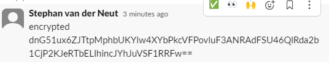
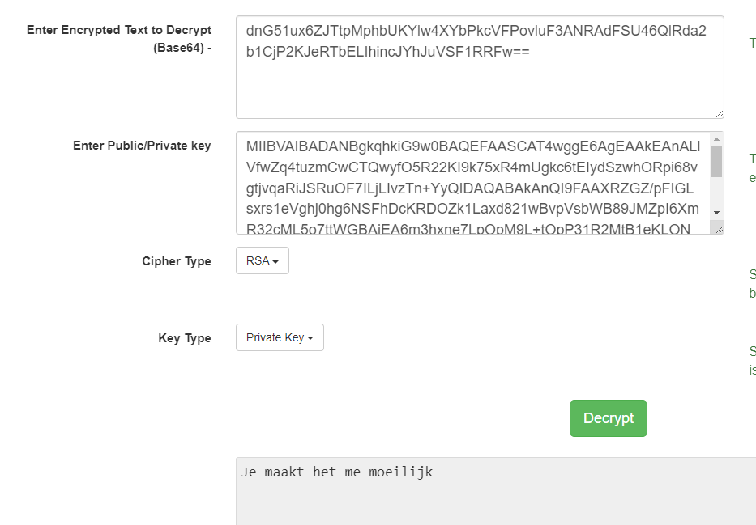

# [Asymmetric Encryption]
[Geef een korte beschrijving van het onderwerp]

## Key-terms
[Schrijf hier een lijst met belangrijke termen met eventueel een korte uitleg.]

## Opdracht
### Gebruikte bronnen
- [RSA](https://www.encryptionconsulting.com/education-center/what-is-rsa/)
- [RSA Tool](https://www.javainuse.com/rsagenerator)
- [AES Tool](https://www.javainuse.com/aesgenerator)
- [YT Sunny Uitleg](https://www.youtube.com/watch?v=vk3py9M2IfE&list=PLSNNzog5eyduN6o4e6AKFHekbH5-37BdV&index=1&t=0s) 9 filmpjes over basic cryptography

### Ervaren problemen

### Resultaat

Gebruikte keys: 

    Private: MIIBVAIBADANBgkqhkiG9w0BAQEFAASCAT4wggE6AgEAAkEAnALlVfwZq4tuzmCwCTQwyfO5R22KI9k75xR4mUgkc6tEIydSzwhORpi68vgtjvqaRiJSRuOF7ILjLIvzTn+YyQIDAQABAkAnQI9FAAXRZGZ/pFIGLsxrs1eVghj0hg6NSFhDcKRDOZk1Laxd821wBvpVsbWB89JMZpI6XmR32cML5o7ttWGBAiEA6m3hxne7LpOpM9L+tOpP31R2MtB1eKLONS8In7JxB/kCIQCqXdV6BtnvIM2dUOEP4eT2ZzvFRqH8u+RsEwGlDV9rUQIhAIF0GD8ekvDPfZouo5SH539uBq9cyeHKFZDs3hhB04URAiANTp0BFg3pxrcoxYt+0RcwQ+oAQ78dXZO++VEUklHUsQIgEeDrxyYB4uQfTGpo5MrCW9HQlGwtG1g0QG7RYZ/wRuQ=

    Public:
    MFwwDQYJKoZIhvcNAQEBBQADSwAwSAJBAJwC5VX8GauLbs5gsAk0MMnzuUdtiiPZO+cUeJlIJHOrRCMnUs8ITkaYuvL4LY76mkYiUkbjheyC4yyL805/mMkCAwEAAQ==

Encrypted bericht:  

    dnG51ux6ZJTtpMphbUKYlw4XYbPkcVFPovluF3ANRAdFSU46QlRda2b1CjP2KJeRTbELIhincJYhJuVSF1RRFw==

Vertaling dmv private key:  

    Je maakt het me moeilijk

Verschil met symmetric encryption is dat een publieke key openbaar beschikbaar moet zijn en de private key niet verloren mag worden. ook zorgt dit ervoor dat niemand de berichten kan lezen die door een public key worden beveiligd.