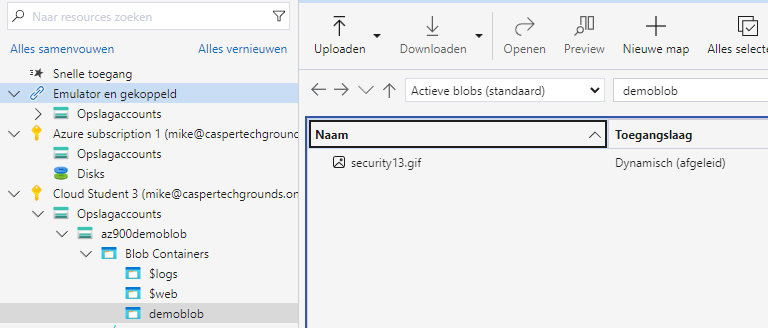
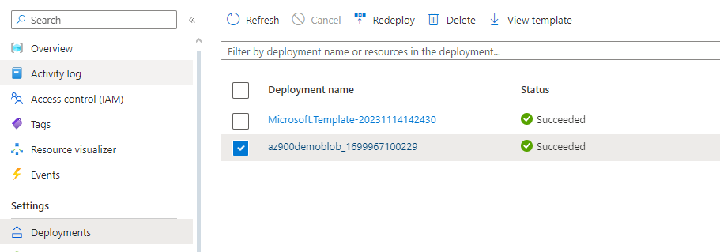

# [Azure Storage Account]
[Geef een korte beschrijving van het onderwerp]

## Key-terms
- BLOB = Binary Large OBject

## Opdracht
### Gebruikte bronnen
- [AZ900>Storage Services](https://marczak.io/az-900/episode-11/cheat-sheet/)
- [static website](https://learn.microsoft.com/nl-nl/azure/storage/blobs/storage-blob-static-website-how-to?tabs=azure-portal)

### Opdracht 1
1. Maak een Azure Storage Account. Zorg dat alleen jij toegang hebt tot de data.
2. Plaats data in een storage service naar keuze via de console (bijvoorbeeld een kattenfoto in Blob storage).
3. Haal de data op naar je eigen computer door middel van de Azure Storage Explorer.

#### Uitwerking

### Opdracht 2
1. Maak een nieuwe container aan.
2. Upload de 4 bestanden die samen de AWS Demo Website vormen.
3. Zorg dat Static Website Hosting aan staat.
4. Deel de URL met een teamgenoot. Zorg ervoor dat je teamgenoot de website kan zien.

 

