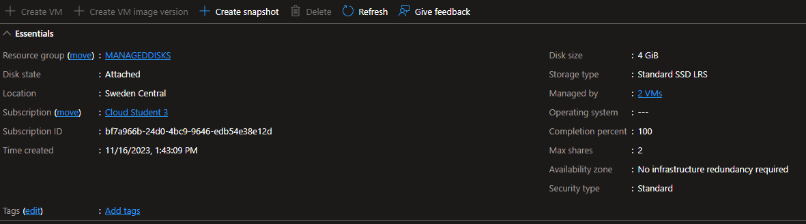
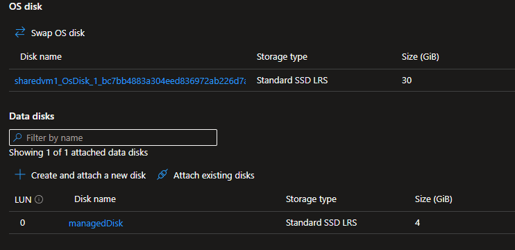
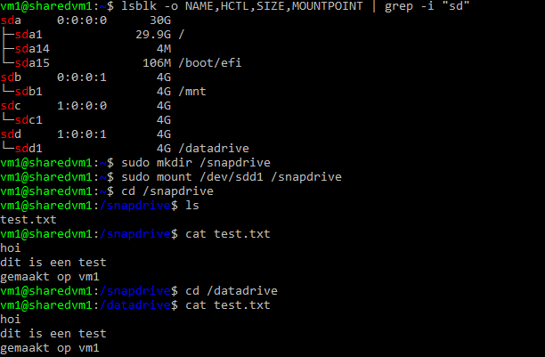
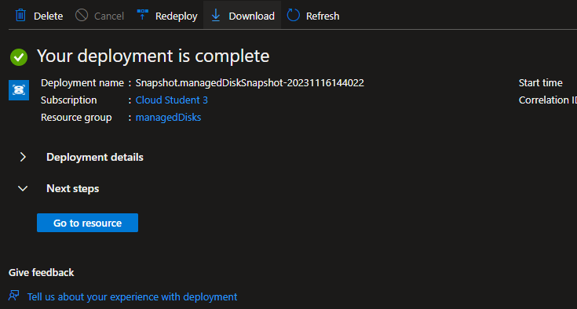
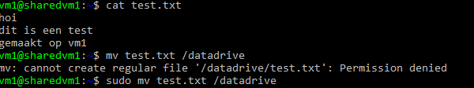
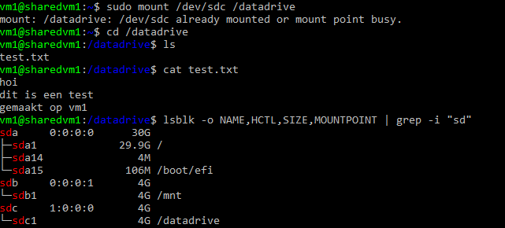

# [Azure Disk Storage]
[Geef een korte beschrijving van het onderwerp]

## Key-terms
[Schrijf hier een lijst met belangrijke termen met eventueel een korte uitleg.]

## Opdracht
### Gebruikte bronnen
- [Disks Types](https://learn.microsoft.com/en-us/azure/virtual-machines/disks-types)
- [Shared Disks VM](https://learn.microsoft.com/en-us/azure/virtual-machines/disks-shared)
- [Mount Disk](https://learn.microsoft.com/en-us/azure/virtual-machines/linux/attach-disk-portal?tabs=ubuntu#mount-the-disk)

## Opdracht
- Start 2 Linux VMs. Zorg dat je voor beide toegang hebt via SSH.
- Maak een Azure Managed Disk aan en koppel deze aan beide VMs tegelijk.
- Creëer op je eerste machine een bestand en plaats deze op de Shared Disk.
- Kijk op de tweede machine of je het bestand kan lezen. (let op: het kan zijn dat je de disk opnieuw moet mounten op je 2e VM)  
- Maak een snapshot van de schijf en probeer hier een nieuwe Disk mee te maken
- Mount deze nieuwe Disk en bekijk het bestand.

### Ervaren problemen
[Geef een korte beschrijving van de problemen waar je tegenaan bent gelopen met je gevonden oplossing.]

### Resultaat

 

 

 

 

 

