# Opdrachten week 5

## ALB & Auto Scaling Part 1
### Opdracht Beschrijving  
Maak een Virtual Machine Scale Set met de volgende vereisten:
- Ubuntu Server 20.04 LTS - Gen1
- Size: Standard_B1ls
- Allowed inbound ports:
    * SSH (22)
    * HTTP (80)
- OS Disk type: Standard SSD
- Networking: defaults
- Boot diagnostics zijn niet nodig

- Custom data:  

```
#!/bin/bash     
sudo su 
apt update  
apt install apache2 -y  
ufw allow 'Apache'  
systemctl enable apache2    
systemctl restart apache2   
```
- Initial Instance Count: 2
- Scaling Policy: Custom
- Aantal VMs: minimaal 1 en maximaal 4
- Voeg een VM toe bij 75% CPU gebruik
- Verwijder een VM bij 30% CPU gebruik
    
## ALB & Auto Scaling Part 2
### Opdracht Beschrijving
- Controleer of je via het endpoint van je load balancer bij de webserver kan komen.
- Voer een load test uit op je server(s) om auto scaling the activeren. Er kan een delay zitten in het creëren van nieuwe VMs, afhankelijk van de settings in je VM Scale Set. Let op: de Azure Load Testing service kan prijzig zijn. Je kan ook inloggen op de VM om een handmatige stress test te doen.

## ALB & Auto Scaling Uitwerking opdracht 1 en 2
Create/Review virtual machine scale set 
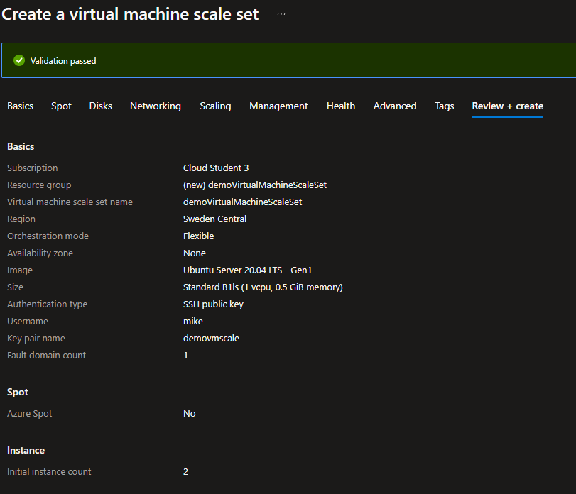 
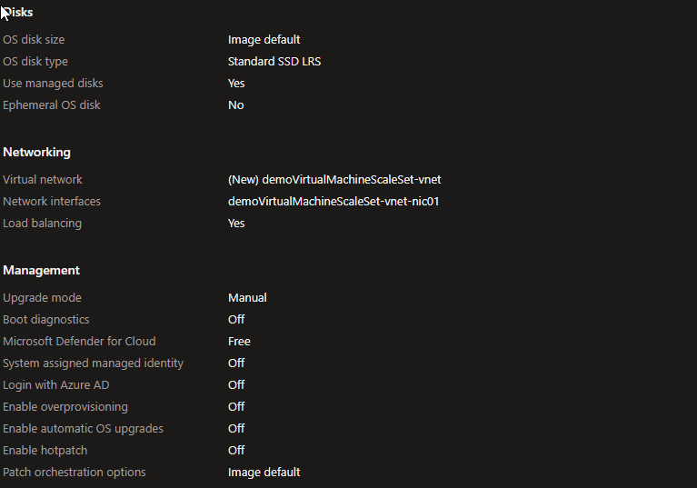 
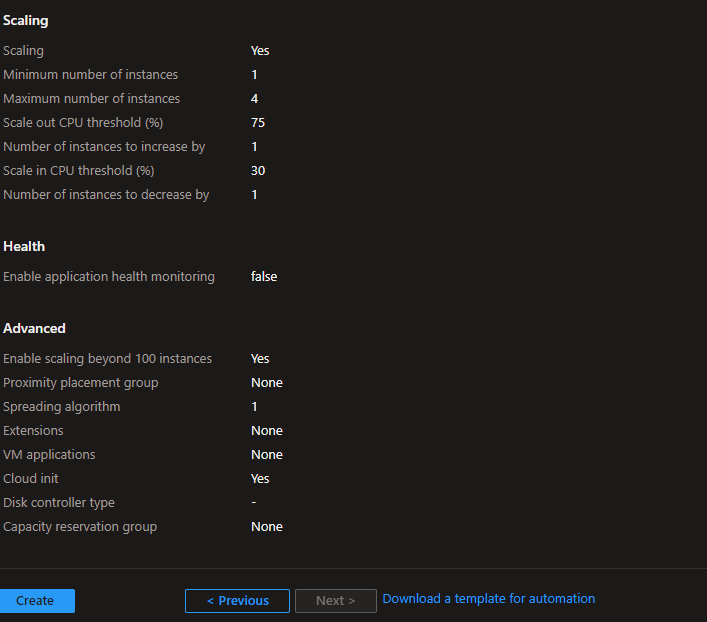 

Load Balancer deployed en het public ip voor de load balancer   
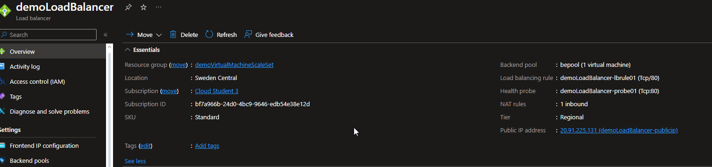 
Preview van de webpagina via load balancer ip   
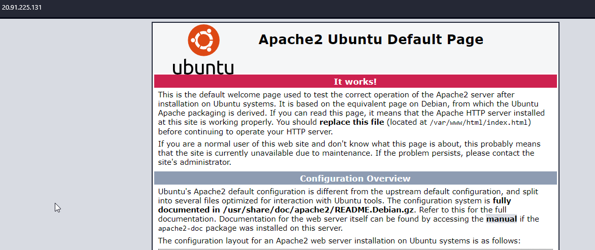 

Scaling rules input. Bij 75% cpu gebruik komt er 1 vm bij, er zit een delay van 5 minuten in zodat het systeem niet reageert op mini pieken in cpu gebruik. Bij 30% wordt het downscale process geactiveerd, ook hier is dit delay aanwezig.    
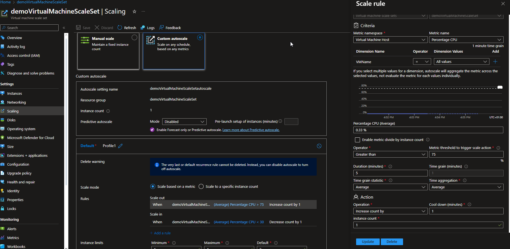

Stress test in terminal. Virtual machine stresstest van 80 % cpu, dit moet ervoor zorgen dat de auto scaling geactiveerd wordt en er meerder vm's aangemaakt worden.    
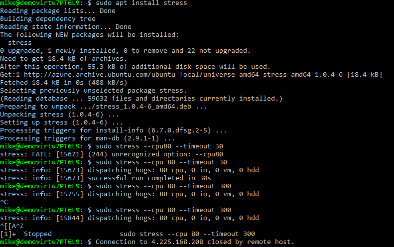 
Start met 2 instances (bij het opzetten schaalde deze automatisch terug naar 1 vm vanwege het lage cpu verbruik) 
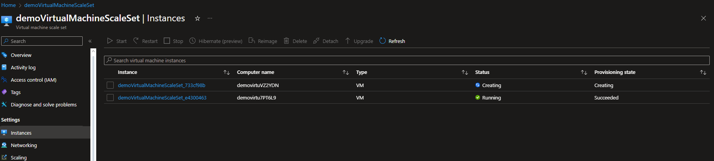 
Steekproef tijdens de test, 2 vms upscale naar 3 vms.
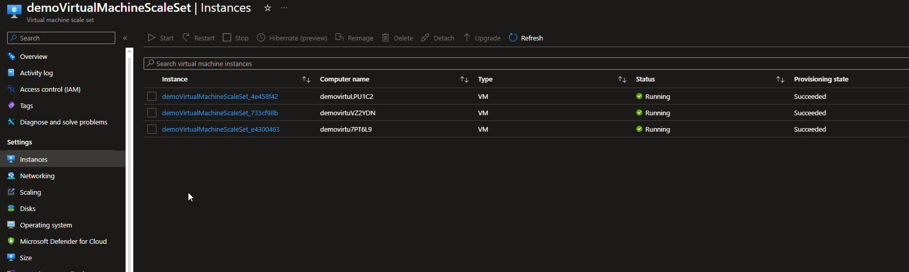 
Een tijdje na de test is er gedownscaled terug naar 1 vm.
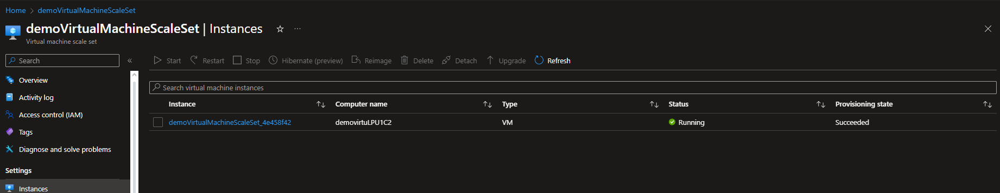 

## Azure Files, App Service, CDN , DNS, SQL
### Opdracht Beschrijving
Doe praktische ervaring op met:
- Azure Files
- SQL Databases in Azure
- Azure App Service 

Doe theoretische kennis op van:
- Azure CDN
- Azure DNS

### Azure Files
Azure file > File share 
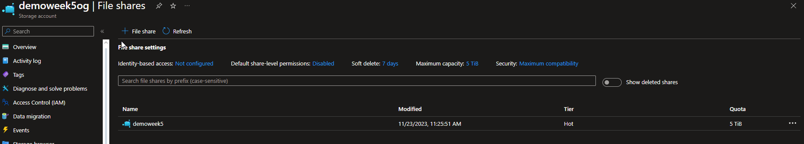

### Azure SQL Database
Create sql Database 
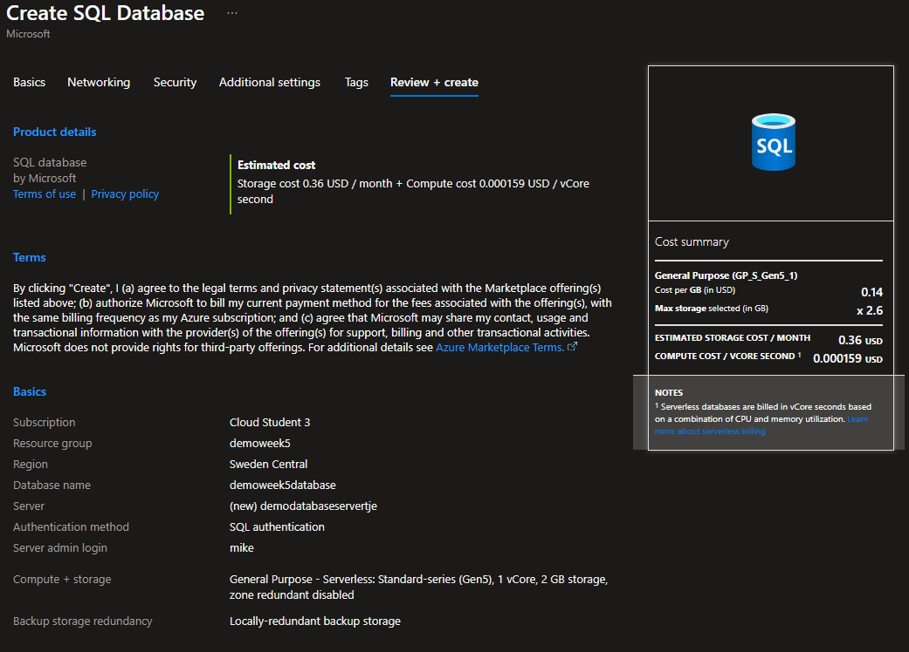 
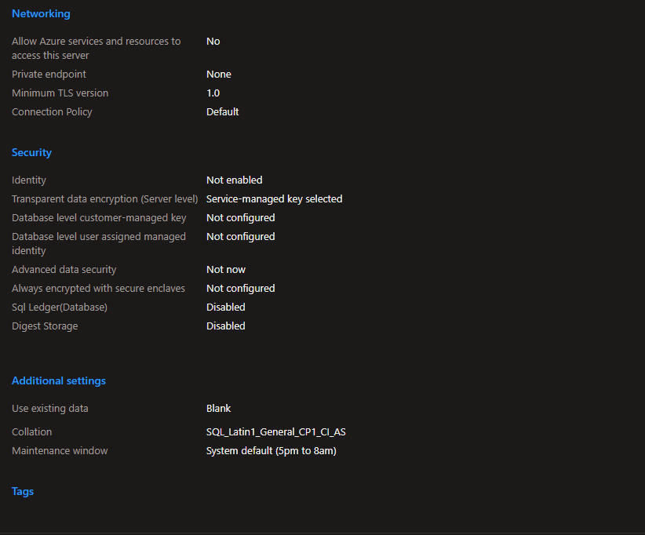

Database server overview    
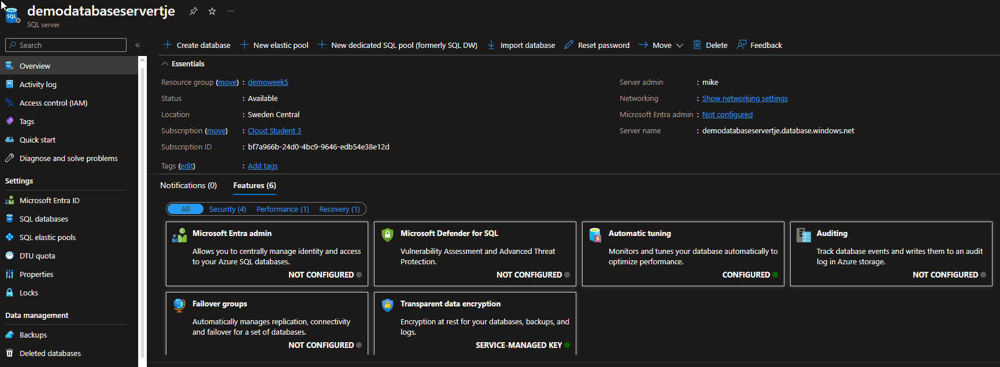 

SQL database overview   
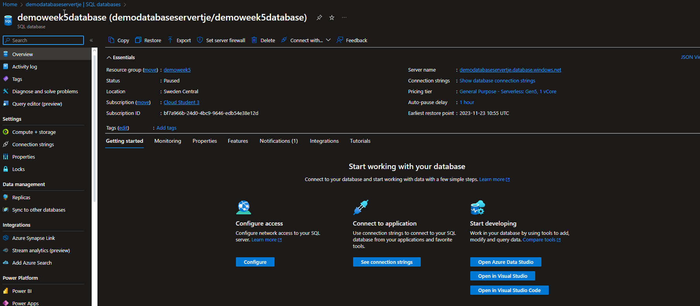 

### Azure App Service
App service types   
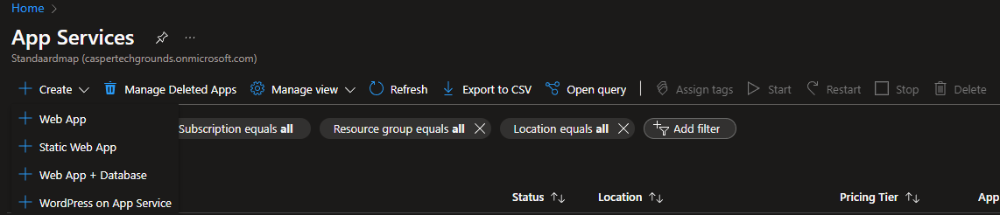

Create web app + database
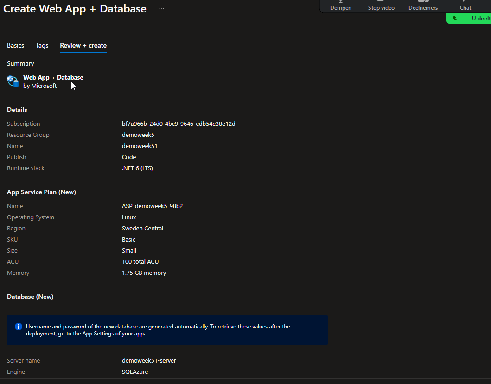 
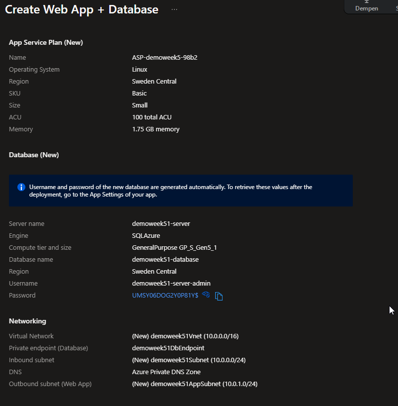 

Create app service zonder database
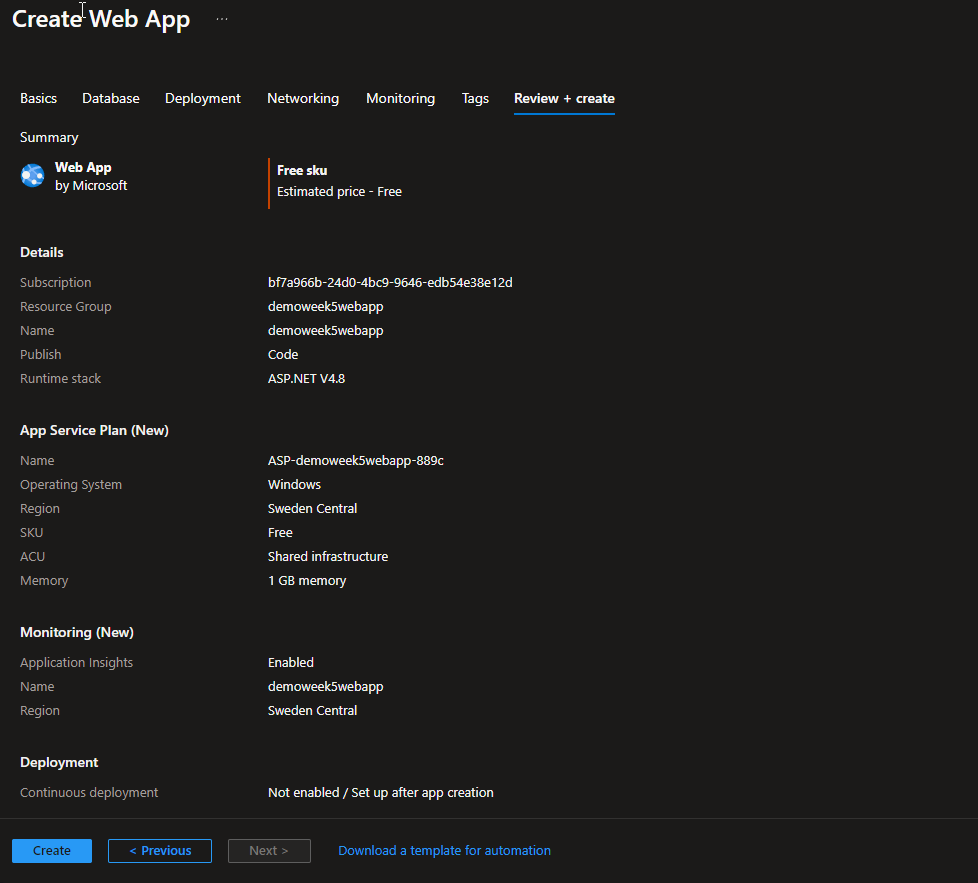

App service overview
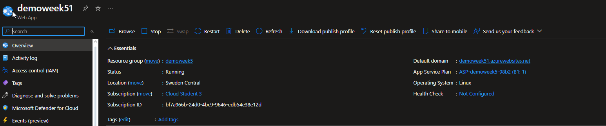 
Web app public ip webpage preview      
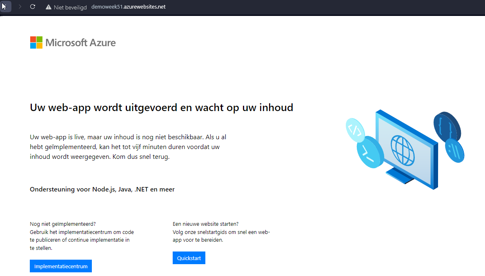 


### Extra opdracht Build first webapp
- [Youtube buildYourFirstWebApp](https://www.youtube.com/watch?v=0QO2jdinCoQ)