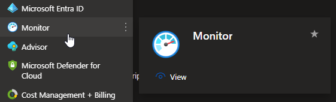
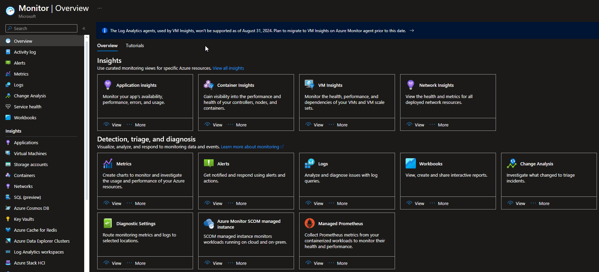
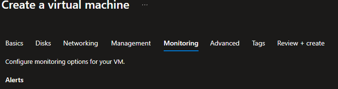

# Azure Monitor <[MS Learn](https://learn.microsoft.com/nl-nl/azure/azure-monitor/overview)>
Azure Monitor is een uitgebreide oplossing binnen Microsoft Azure die ontworpen is voor het monitoren en beheren van de prestaties en status van applicaties, infrastructuur, services en netwerken in de cloud, on-premises en hybride omgevingen. Het biedt tools en functies om te helpen bij het verzamelen, analyseren en acteren op gegevens voor proactieve monitoring, foutopsporing en probleemoplossing.

Belangrijke aspecten van Azure Monitor zijn onder andere:

- **Monitoring van resources**: Azure Monitor biedt mogelijkheden om verschillende Azure-resources te monitoren, zoals virtuele machines, databases, opslagaccounts, netwerken, en meer. Het verzamelt metrische gegevens en logboeken van deze resources om hun prestaties en gezondheid te evalueren.

- **Metrische gegevens en logboeken**: Het verzamelt metrische gegevens, waaronder CPU-gebruik, geheugenverbruik, netwerkverkeer en aangepaste metingen, om prestaties te evalueren. Ook verzamelt het logboeken van verschillende bronnen om activiteiten, fouten en waarschuwingen vast te leggen.

- **Krachtige queries en analyses**: Azure Monitor biedt een krachtige querytaal, Kusto Query Language (KQL), waarmee gebruikers gegevens kunnen doorzoeken, filteren, analyseren en visualiseren. Dit stelt hen in staat om inzicht te krijgen in trends, problemen te identificeren en rapporten te genereren.

- **Waarschuwingen en acties**: Het stelt gebruikers in staat om waarschuwingen in te stellen op basis van aangepaste drempels of queryresultaten. Hierdoor kunnen ze proactief reageren op afwijkingen of problemen in de gemonitorde resources.

- **Integratie met andere services**: Azure Monitor integreert met andere Azure-services, zoals Azure Log Analytics, Application Insights, Azure Security Center en meer, waardoor gebruikers een uitgebreider inzicht krijgen in de gezondheid, prestaties en beveiliging van hun Azure-implementaties.

Azure Monitor biedt een geïntegreerd platform voor monitoring en beheer, waardoor organisaties de betrouwbaarheid, prestaties en beveiliging van hun cloud- en hybride omgevingen kunnen verbeteren.

# Know-How Theorie
### Welk probleem lost Azure Monitor op?
Met Azure Monitor worden applicaties, services, infrastructuur en netwerken binnen Azure gemonitored en geanalyseerd. Deze service zorgt voor inzicht in je cloudservice, voor alle  applicaties, netwerkstructuur, infrastructuur en services. 
Door de analyses van Azure monitor ontstaat er een prestatiebewaking en optimalisatie, proactief detecteren van problemen, uitgebruide analysehulpmiddelen en inzichten en beveiligingsmonitor.

### Welke key termen horen bij Azure Monitor?

### Hoe past Azure Monitor / vervangt Azure Monitor in een on-premises setting?
Als analysetool om processen op de gewenste OSI-model laag te monitoren.

### Hoe kan ik Azure Monitor combineren met andere diensten?
Veel services kunnen door Azure monitor geanalyseerd worden, bij het creëren van resources is er een monitor-tabblad. Dit is de Azure Monitor services die met instellingen in dit tabblad word aangemaakt en geactiveerd.

### Wat is het verschil tussen Azure Monitor en andere gelijksoortige diensten?
Azure monitor is de analysetoolv van Azure, er zijn andere services beschikbaar die als extensies van Azure monitor werken, dus niet als vervanging maar als uitbereiding voor specifieke wensen.

## Know-How Praktijk
### Waar kan ik Azure Monitor vinden in de console?
Azure Monitor is in het quickmenu aan de linkerkant te vinden, of via de zoekbalk boven in. 

Dit is de overview pagina van Azure Monitor:    

### Hoe zet ik Azure Monitor aan?
Dit kan tijdens het maken van een resource waar je de Azure Monitor voor wilt gebruiken, ook is het mogelijk om Azure Monitor te deployen en zelf koppelingen te maken naar de dienst of dergelijke waarvan je een analyse wilt maken.

### Hoe kan ik deze dienst koppelen aan andere resources?
Tijdens het maken van een nieuwe resource is hier een mogelijkheid voor, ook kan er via Azure Monitor nieuwe resources toegevoegd worden.

Tijdens het deployen van een VM machine is er een mogelijkheid om Monitor opties te configureren.

    

## Bronnen
[MS Learn](https://learn.microsoft.com/nl-nl/azure/azure-monitor/overview)