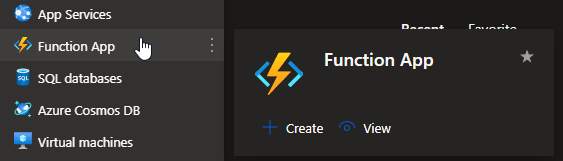

# Event Grid <[MS Learn](https://learn.microsoft.com/nl-nl/azure/event-grid/overview)>
Azure Event Grid is een gebeurtenisrouteringsservice binnen Microsoft Azure die het mogelijk maakt om gebeurtenissen te beheren en te routeren tussen verschillende Azure-services, applicaties en externe bronnen. Het fungeert als een centraal platform voor het vastleggen, verwerken en reageren op gebeurtenissen in real-time.

Belangrijke kenmerken van Azure Event Grid zijn onder meer:

- **Gebeurtenispublicatie en -abonnement**: Azure Event Grid maakt gebruik van een publicatie/abonnementmodel. Services kunnen gebeurtenissen publiceren naar het Event Grid, terwijl andere services zich kunnen abonneren op specifieke gebeurtenissen die ze willen ontvangen en verwerken.

- **Verscheidenheid aan bronnen en doelen**: Het ondersteunt een breed scala aan bronnen die gebeurtenissen kunnen genereren, zoals Azure-services, aangepaste toepassingen, IoT-apparaten en externe services. Evenzo kunnen gebeurtenissen worden afgeleverd bij verschillende doelen zoals Azure Functions, Logic Apps, Service Bus, webhooks, etc.

- **Flexibele routing en filtering**: Event Grid biedt flexibele routing van gebeurtenissen op basis van filters, zodat alleen relevante gebeurtenissen worden afgeleverd bij de geabonneerde services. Dit minimaliseert de overhead en zorgt voor efficiëntere verwerking.

- **Schaalbaarheid en betrouwbaarheid**: Het is schaalbaar en betrouwbaar, waarbij het automatisch kan reageren op pieken in gebeurtenisvolumes en hoge beschikbaarheid biedt voor het verwerken van gebeurtenissen.

- **Real-time verwerking**: Door gebeurtenissen in bijna real-time af te leveren, stelt Event Grid gebruikers in staat om snel te reageren op gebeurtenissen en workflows te automatiseren op basis van deze gebeurtenissen.

Azure Event Grid wordt vaak gebruikt voor het bouwen van reactieve, event-driven architecturen waarin gebeurtenissen en acties worden gekoppeld tussen verschillende services en systemen binnen Azure en ook daarbuiten. Het maakt een flexibele en schaalbare communicatie mogelijk tussen verschillende componenten van gedistribueerde systemen.

# Know-How Theorie
### Welk probleem lost Event Grid op?
Azure Event Grid is een zeer schaalbare, volledig beheerde Pub Sub-berichtendistributieservice die flexibele berichtverbruikspatronen biedt met behulp van de MQTT- en HTTP-protocollen. Met Azure Event Grid kunt u gegevenspijplijnen bouwen met apparaatgegevens, toepassingen integreren en serverloze architecturen bouwen op basis van gebeurtenissen.

### Welke key termen horen bij Event Grid?

### Hoe past Event Grid / vervangt Event Grid in een on-premises setting?
Azure Event Grid kan worden gebruikt in on-premises omgevingen om klanten te helpen bij het optimaliseren van lokale hardware en software.

### Hoe kan ik Event Grid combineren met andere diensten?
De kracht van Azure Event Grid ligt in de mogelijkheid om naadloos te integreren met verschillende services, zowel binnen Azure als daarbuiten, waardoor het een centrale hub wordt voor het beheren en routeren van gebeurtenissen binnen een applicatie-ecosysteem.

### Wat is het verschil tussen Event GridX en andere gelijksoortige diensten?
Het verschil tussen Event Grid, Queue Storage en Service Bus is dat Event Grid specifiek is ontworpen voor gebeurtenisroutering, terwijl Queue Storage en Service Bus specifiek zijn ontworpen voor berichtenverzending en -ontvangst. Andere gelijksoortige diensten kunnen breder zijn en advies geven over een breed scala aan technologieën.

## Know-How Praktijk
### Waar kan ik deze dienst vinden in de console?
Deze dienst is te vinden via de zoekfunctie

### Hoe zet ik deze dienst aan?
Er zijn verschillende opties mogelijk bij het aanmaken van een Event Grid. Al deze opties staan onder Event Grid weergeven:

### Hoe kan ik deze dienst koppelen aan andere resources?
Als communicatie middel kan deze dienst met vrijwel alle azure services gekoppeld worden.

## Bronnen
[MS Learn](https://learn.microsoft.com/nl-nl/azure/event-grid/overview)