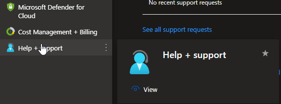

# Azure Advisor <[MS Learn](https://learn.microsoft.com/nl-nl/azure/advisor/advisor-overview)>
Azure Advisor is een tool die ontworpen is om klanten te helpen bij het optimaliseren van hun Azure-resources op basis van het Well Architected Framework voor betere prestaties, kostenbesparingen, beveiliging en betrouwbaarheid. Het is een gepersonaliseerde adviestool die aanbevelingen en best practices biedt op basis van de configuratie en het gebruik van je Azure-services.

Azure Advisor analyseert continu de configuraties en activiteiten binnen je Azure-abonnement en geeft vervolgens aanbevelingen in verschillende categorieën van het Well-Architected framework.

De adviezen van Azure Advisor zijn gebaseerd op bewezen best practices en analyses van de specifieke gebruiksgegevens van jouw Azure-resources. Het doel is om klanten te helpen hun Azure-infrastructuur te optimaliseren en te voldoen aan de vereisten voor kosten, prestaties, beveiliging en beschikbaarheid, wat leidt tot een betere algehele ervaring en efficiënter gebruik van resources.

# Know-How Theorie
### Welk probleem lost Azure Advisor op?
Azure Advisor geeft een overzicht van alle verbeterpunten voor de 5 pilaren van het Well-Architected Framework. Per Pilaar is er een uitgebreide lijst aan mogelijke suggesties om je resources maximaal te optimaliseren

### Welke key termen horen bij Azure Advisor?
- Well-architected framework

### Hoe past Azure Advisor / vervangt Azure Advisor in een on-premises setting?
Analyse tool om alle huidige cloud resources te verbeteren en te optimaliseren.

### Hoe kan ik Azure Advisor combineren met andere diensten?

### Wat is het verschil tussen Azure Advisor en andere gelijksoortige diensten?
Azure Advisor adviseerd de klant hoe die zijn resources kan optimaliseren.

## Know-How Praktijk
### Waar kan ik deze dienst vinden in de console?
Via het menu is deze dienst te vinden, dit kan ook via de zoekfunctie.

 

### Hoe zet ik deze dienst aan?
Deze dienst staat standaard aan.

## Bronnen
[MS Learn](https://learn.microsoft.com/nl-nl/azure/advisor/advisor-overview)