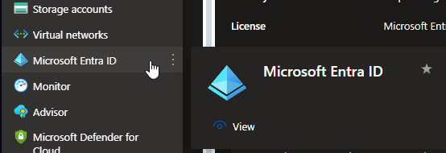
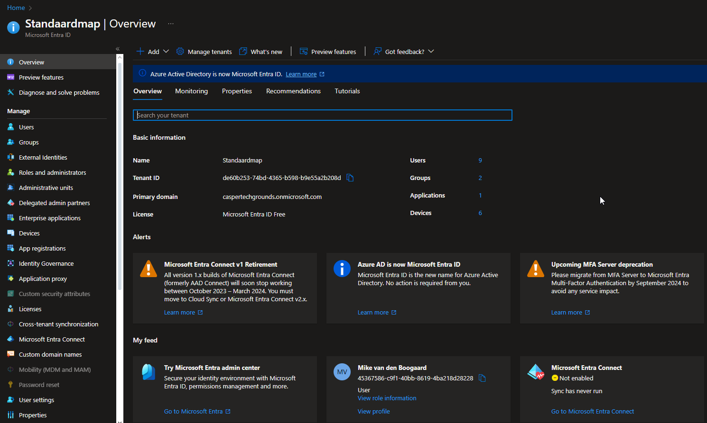
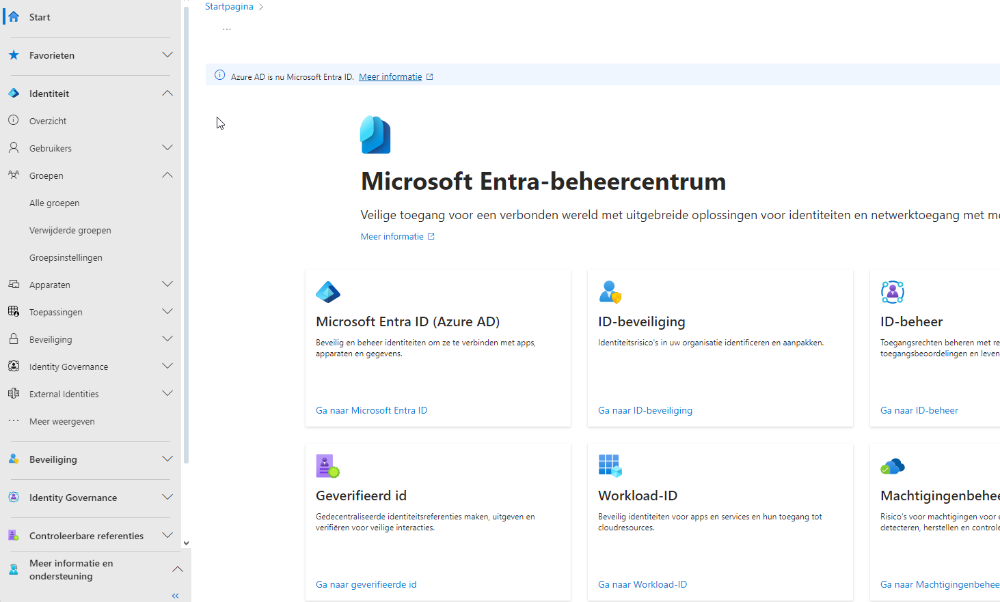
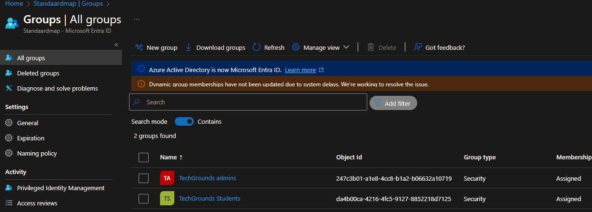
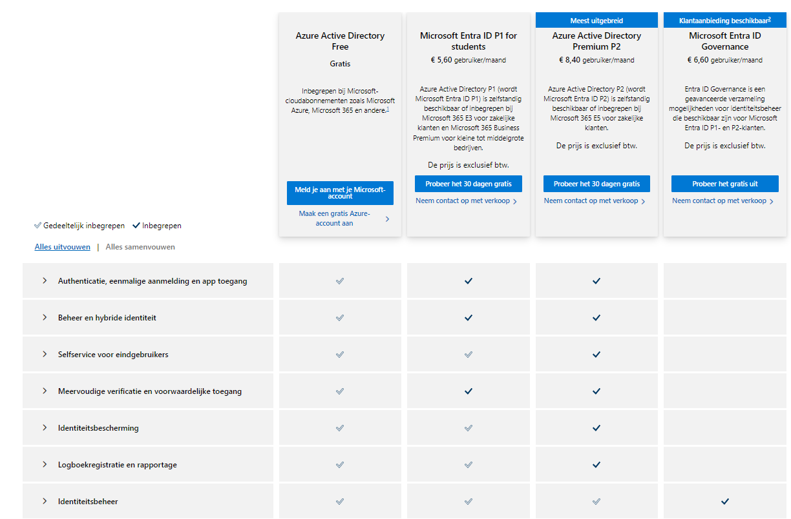
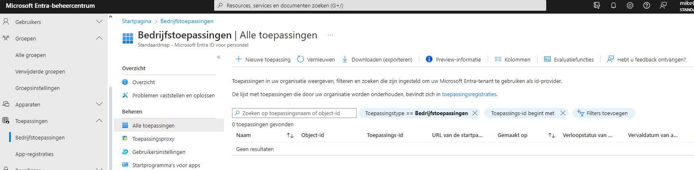

# Microsoft Entra ID <[MS Learn](https://learn.microsoft.com/nl-nl/entra/verified-id/decentralized-identifier-overview)>

Voorheen was dit Azure AD. Microsoft Entra ID is hiervan de vervanger en heeft uitgebreidere functies.

In de huidige wereld worden onze digitale en fysieke levens steeds meer met elkaar verbonden met de apps, services en apparaten die we gebruiken. Deze digitale revolutie heeft een wereld van mogelijkheden geopend, waardoor we verbinding kunnen maken met talloze bedrijven en individuen op manieren die ooit onvoorstelbaar waren.

Deze verhoogde connectiviteit introduceert een groter risico op identiteitsdiefstal en gegevensschendingen. Deze schendingen kunnen een verwoestende impact hebben op ons persoonlijke en professionele leven. Maar er is hoop. Microsoft werkt samen met een diverse community om een gedecentraliseerde identiteitsoplossing te maken waarmee personen de controle krijgen over hun eigen digitale identiteiten, waardoor ze een veilige en persoonlijke manier bieden om identiteitsgegevens te beheren zonder te vertrouwen op gecentraliseerde autoriteiten of intermediairs.

**Hoe werkt gedecentraliseerde identiteit?**    
We hebben een nieuwe vorm van identiteit nodig. We hebben een identiteit nodig die technologieën en standaarden samenbrengt om belangrijke identiteitskenmerken te leveren, zoals zelfeigendom en censuurweerstand. Deze mogelijkheden zijn moeilijk te bereiken met behulp van bestaande systemen.

Om aan deze beloftes te kunnen doen, hebben we een technische basis nodig die bestaat uit zeven belangrijke innovaties. Een belangrijke innovatie is id's die eigendom zijn van de gebruiker, een gebruikersagent voor het beheren van sleutels die zijn gekoppeld aan dergelijke id's en versleutelde, door de gebruiker beheerde gegevensarchieven.

# Know-How Theorie
### Welk probleem lost Microsoft Entra ID op?
Toegangs en identiteits controle/beheer, hiermee zorgt de it-beheerder ervoor dat iedereen bij de juiste resources kan komen op basis van het PoLP principe. Er is een mogelijkheid voor een SSO (Single-sign on).

### [Terminologie](https://learn.microsoft.com/nl-nl/entra/fundamentals/whatis#terminology)
|||
|Term of concept|Omschrijving|
|---|---|
|Identity|Een ding dat kan worden geverifieerd. Een identiteit kan een gebruiker met een gebruikersnaam en wachtwoord zijn. Identiteiten omvatten ook toepassingen of andere servers die mogelijk moeten worden geverifieerd via geheime sleutels of certificaten. |
|Account |Een identiteit waaraan gegevens zijn gekoppeld. U kunt geen account hebben zonder een identiteit. |
|Microsoft Entra account |Een identiteit die is gemaakt via Microsoft Entra ID of een andere Microsoft-cloudservice, zoals Microsoft 365. Identiteiten worden opgeslagen in Microsoft Entra-id en zijn toegankelijk voor de cloudserviceabonnementen van uw organisatie. Dit account wordt ook wel een werk- of schoolaccount genoemd. |
|Account Administrator |Deze rol van klassieke abonnementsbeheerder is conceptueel gezien de eigenaar facturering van een abonnement. Met deze rol kunt u alle abonnementen in een account beheren. |
|Service Administrator |Met deze klassieke abonnementsbeheerdersrol kunt u alle Azure-resources beheren, inclusief de toegang. Deze rol heeft dezelfde toegang als een gebruiker met de rol van eigenaar op abonnementsniveau. |
|Owner |Met deze rol kunt u alle Azure-resources beheren, inclusief de toegang. Deze rol bouwt voort op een nieuwer autorisatiesysteem, het zogeheten op rollen gebaseerd toegangsbeheer van Azure (Azure RBAC), waarmee uiterst gedetailleerd toegangsbeheer tot Azure-resources kan worden verkregen.  |
|Microsoft Entra Global Administrator |Deze beheerdersrol wordt automatisch toegewezen aan degene die de Microsoft Entra-tenant heeft gemaakt. U kunt meerdere globale Beheer istrators hebben, maar alleen Globale Beheer beheerders kunnen beheerdersrollen toewijzen (waaronder het toewijzen van andere globale Beheer istrators) aan gebruikers. |
|Azure subscription |	Dit wordt gebruikt voor de betaling van Azure-cloudservices. U kunt zo veel abonnementen hebben als u wilt. Ze zijn gekoppeld aan uw creditcard. |
|Azure tenant |Een toegewezen en vertrouwd exemplaar van Microsoft Entra ID. De tenant wordt automatisch gemaakt wanneer uw organisatie zich registreert voor een abonnement op een cloudservice van Microsoft. Deze abonnementen omvatten Microsoft Azure, Microsoft Intune en Microsoft 365. Een Azure-tenant vertegenwoordigt één organisatie. |
|Single tenant |Azure-tenants die toegang hebben tot andere services in een toegewezen omgeving, worden als single tenant beschouwd. |
|Multi-tenant |Azure-tenants die toegang hebben tot andere services in een gedeelde omgeving in meerdere organisaties, worden als multi-tenants beschouwd. |
|Microsoft Entra directory |Elke Azure-tenant heeft een toegewezen en vertrouwde Microsoft Entra-directory. De Microsoft Entra-directory bevat de gebruikers, groepen en apps van de tenant en wordt gebruikt voor het uitvoeren van identiteits- en toegangsbeheerfuncties voor tenantbronnen. |
|Custom domain |Elke nieuwe Microsoft Entra-directory wordt geleverd met een initiële domeinnaam, bijvoorbeeld domainname.onmicrosoft.com. Naast die initiële naam kunt u ook de domeinnamen van uw organisatie toevoegen. De domeinnamen van uw organisatie omvatten de namen die u voor uw bedrijf gebruikt en waarmee uw gebruikers toegang tot de resources van de organisatie krijgen. Als u aangepaste domeinnamen toevoegt, kunt u gebruikersnamen maken waarmee uw gebruikers vertrouwd zijn, zoals alain@contoso.com. |
|Microsoft account (also called, MSA) |Persoonlijke accounts die toegang verlenen tot uw consumentgerichte producten en cloudservices van Microsoft. Deze producten en services omvatten Outlook, OneDrive, Xbox LIVE of Microsoft 365. Uw Microsoft-account wordt gemaakt en opgeslagen in het accountsysteem voor consumentidentiteiten van Microsoft, dat wordt beheerd door Microsoft. |

### Hoe past Microsoft Entra ID / vervangt Microsoft Entra ID in een on-premises setting?
Door middel van Microsoft Entra ID kunnen werknemers gemakkelijk inloggen op de systemen met 1 login. Bedrijven kunnen on-premises adreslijst verbinden met Microsoft Entra ID met behulp van Microsoft Entra Verbinding. Uitgebreide informatie hierover: [Ms Learn](https://learn.microsoft.com/nl-nl/entra/identity/hybrid/whatis-hybrid-identity)

### Hoe kan ik Microsoft Entra ID combineren met andere diensten?
Microsoft Entra ID is te verbinden met alle resources waar login of rechten voor nodig zijn. Dit wordt al gebruik voor gebruikers van resources zoals Ms365, Office365

### Wat is het verschil tussen Microsoft Entra ID en andere gelijksoortige diensten?
Binnen Azure zijn er geen alternative voor deze dienst. Elke cloudservice heeft zijn eigen admin-beheerstool.

## Know-How Praktijk
### Waar kan ik deze dienst vinden in de console?
Microsoft Entra ID is links in het menu te vinden, of via de zoekfunctie boven in.  

Zo ziet het overview venster van Microsoft Entra ID eruit:  
 

Dit is het Microsoft Entra-beheercentrum. Via het overview kom je hier door my feed aan te klikken
 

Voorbeeld ingestelde groepen binnen Ms Entra 
  

### Hoe zet ik deze dienst aan?
Er zijn 4 subscribtions beschikbaar. De Azure Active Directory subscribtion is gratis en zit standaard bij een zakelijke subscribtion. Om gebruik te maken van P1, P2 en Ms Entra ID Governance zijn er verschillende subscribtion niveau's beschikbaar met ieder eigen functies en kosten. 

Hieronder het overzicht door Microsoft gegeven ([bron](https://www.microsoft.com/nl-nl/security/business/microsoft-entra-pricing?rtc=1&market=nl))

### Hoe kan ik deze dienst koppelen aan andere resources?
Via het Entra-beheercentrum kan er onder het kopje *toepassingen*, resources toegevoegd worden aan MS Entra die door je organistatie gebruikt worden.

## Bronnen
[MS Learn](https://learn.microsoft.com/nl-nl/entra/verified-id/decentralized-identifier-overview)

