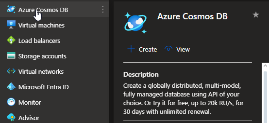
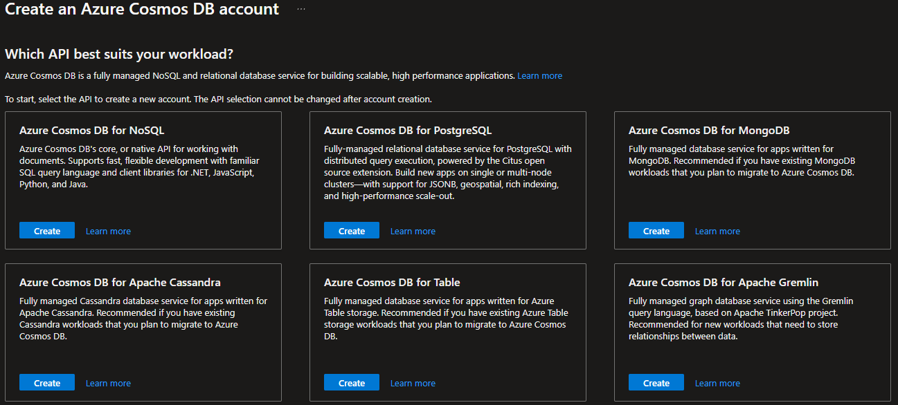

# CosmosDB <[MS Learn](https://learn.microsoft.com/nl-nl/azure/cosmos-db/)>
Azure Cosmos DB is een volledig beheerde NoSQL-database service die wordt aangeboden door Microsoft Azure. Het is ontworpen om wereldwijd gedistribueerde applicaties te ondersteunen met een schaalbare en flexibele architectuur.

Belangrijke kenmerken van Azure Cosmos DB zijn onder meer:

- **Multi-model en NoSQL**: Cosmos DB ondersteunt diverse datamodellen zoals documenten, sleutel-waardeparen, grafieken en kolommen. Het biedt ook een schema-agnostische aanpak, waardoor het flexibel is in het opslaan en beheren van gegevens zonder een vaste structuur.

- **Schaalbaarheid**: Het biedt naadloze schaalbaarheid, zowel in termen van opslagcapaciteit als doorvoer (throughput). Hierdoor kan de database eenvoudig worden aangepast aan de behoeften van applicaties en kan het wereldwijd gedistribueerd worden voor snelle en lage-latentie toegang.

- **Global Distribution**: Cosmos DB biedt de mogelijkheid om gegevens wereldwijd te distribueren over meerdere Azure-regio's. Dit zorgt voor een lage latentie en hoge beschikbaarheid voor gebruikers over de hele wereld.

- **Consistentie niveaus**: Het biedt verschillende niveaus van consistentie om tegemoet te komen aan de verschillende vereisten van applicaties, variërend van sterke consistentie tot eventuele consistentie met hoge beschikbaarheid.

- **Ingebouwde beveiliging en naleving**: Cosmos DB biedt ingebouwde beveiligingsfuncties zoals firewall-regels, toegangsbeheer, encryptie van gegevens in rust en in transit, evenals nalevingscertificeringen zoals GDPR, HIPAA, en meer.

Azure Cosmos DB wordt vaak gebruikt voor moderne applicaties die behoefte hebben aan schaalbaarheid, wereldwijde beschikbaarheid, flexibele datamodellering en hoge prestaties. Het biedt ontwikkelaars een krachtige tool om diverse soorten data te beheren en te schalen naar wereldwijde gebruikers.

# Know-How Theorie
### Welk probleem lost CosmosDB op?
Azure Cosmos DB is een volledig beheerde NoSQL- en relationele database voor moderne app-ontwikkeling, waaronder; AI, digitale handel, Internet of Things, boekingsbeheer en andere soorten oplossingen. Azure Cosmos DB biedt reactietijden van één milliseconde, automatische en directe schaalbaarheid, samen met gegarandeerde snelheid op elke schaal. De bedrijfscontinuïteit is gewaarborgd met door SLA ondersteunde beschikbaarheid en beveiliging op bedrijfsniveau.

App-ontwikkeling is sneller en productiever dankzij:
- Kant-en-klare gegevensdistributie in meerdere regio's overal ter wereld
- Opensource-API's
- SDK's voor populaire talen.
- AI-databasefunctionaliteiten zoals systeemeigen vectorzoekopdrachten of naadloze integratie met Azure AI Services ter ondersteuning van het ophalen van augmented generation

### Welke key termen horen bij CosmosDB?
- Global Distributed = Zone-redundancy voor fysieke CosmosDB verspreiding wereldwijd.

### Hoe past CosmosDB / vervangt CosmosDB in een on-premises setting?
CosmosDB kan als automatiserings tool gebruikt worden en hiermee de database die on-premises aanwezig is optimaliseren.

### Hoe kan ik CosmosDB combineren met andere diensten?
De CosmosDB is te combineren door middel van API's. Er zijn verschillende mogelijkheden beschikbaar, de opties verschillen in de output die de klant te zien krijgt. Zo kan er voor bijvoorbeeld Apache Gremlin gekozen worden als grafieken de gewenste weergave van de data is. Mocht er een grote hoeveelheid data verwerkt worden, dan is de Apachi Cassandra API de beste keuze.

### Wat is het verschil tussen CosmosDB en andere gelijksoortige diensten?
 Azure Managed Instance zijn te gebruiken in plaats van CosmosDB. Het grote verschil tussen deze dienst en CosmosDB zit in het automatiseren van de database, dit is iets wat CosmosDB grotendeels overneemt voor de klant, bij Azure Managed instance is er meer klant input nodig om de service werkende te houden.

## Know-How Praktijk
### Waar kan ik deze dienst vinden in de console?
De CosmosDB service is te vinden in het menu aan de linkerkant of via de zoekfunctie.

  

### Hoe zet ik deze dienst aan?
Bij het aanmaken van CosmosDB zijn er 6 verschillende api opties waar de gebruiker uit kan kiezen.  

 

### Hoe kan ik deze dienst koppelen aan andere resources?
Deze dienst is tijdens het aanmaken te koppelen aan andere databases door middel van een API. Hiermee kan CosmosDB deze resources optimaliseren en zo effectief mogelijk inzetten.

## Bronnen
[MS Learn](https://learn.microsoft.com/nl-nl/azure/cosmos-db/)
[Samenvatting cosmosDB](https://medium.com/codex/azure-cosmos-db-api-services-dc14a4cafd2c)
