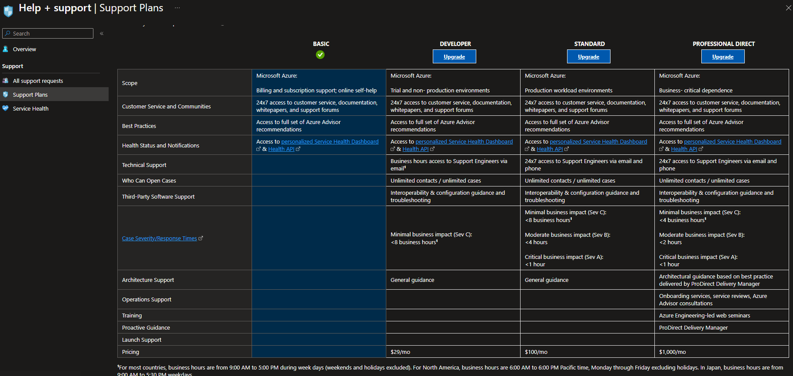

# Azure Support Plans <[MS Compare Support Plans](https://azure.microsoft.com/en-us/support/plans)>
Azure Support Plans zijn service-abonnementen die door Microsoft worden aangeboden om ondersteuning te bieden aan organisaties die Azure-cloudservices gebruiken. Deze plannen zijn bedoeld om klanten te helpen bij het oplossen van problemen, het verkrijgen van technische ondersteuning, en het maximaliseren van de waarde van hun Azure-abonnementen.

Er zijn verschillende niveaus van Azure Support Plans, elk met specifieke functies en mate van ondersteuning:

- **Gratis ondersteuning**: Dit is het basisniveau van ondersteuning dat wordt geleverd bij elk Azure-abonnement. Het omvat toegang tot documentatie, zelfhulpbronnen, communityforums en facturering- en accountbeheerondersteuning.

- **Developer Support**: Dit niveau biedt betaalde ondersteuning voor ontwikkelaars en testomgevingen. Het omvat ook technische ondersteuning via e-mail en heeft een gegarandeerde reactietijd van 12 uur.

- **Standard Support**: Dit is het meest voorkomende ondersteuningsniveau voor productieomgevingen. Het biedt 24/7 technische ondersteuning via telefoon en web, gegarandeerde reactietijden en begeleiding bij probleemoplossing.

- **Professional Direct Support**: Dit is een geavanceerd niveau van ondersteuning dat specifieke aandacht geeft aan bedrijfskritieke situaties. Het biedt directe toegang tot Azure-technische experts, snellere reactietijden en proactieve monitoring.

Overview van de Support Plans   

   

De Azure Support Plans bieden voordelen zoals technische ondersteuning, snellere responstijden voor kritieke problemen, toegang tot specifieke experts en meer. Klanten kunnen het meest geschikte ondersteuningsniveau kiezen op basis van hun bedrijfsbehoeften en de kritikaliteit van hun Azure-implementaties. De kosten van elk plan variëren afhankelijk van het gekozen niveau en de gewenste dekking.

# Know-How Theorie
### Welk probleem lost Azure Support Plans op?
Azure Support plans biedt technische ondersteuning bij gebruik van Azure services, hulp bij het oplossen van problemen en beantwoorden van vragen. Er is toegang tot een uitgebreide documentatie die helpen om de Azure service te begrijpen. Er zijn verschillende SLA's beschikbaar afhankelijk van het niveau die beschikbaarheid en garantie garanderen. De beschikbare niveaus zijn: Basic, Developer, Standard en Professional Direct.!  
 
Ook is er een mogelijkheid om architectuur advies aan te vragen voor klanten die extra hulp nodig hebben bij het ontwerpen van hun structuur.

### Welke key termen horen bij Azure Support Plans?

### Hoe past Azure Support Plans / vervangt Azure Support Plans in een on-premises setting?
Azure Support Plans zijn niet direct een vervanging voor traditionele ondersteuningsopties in een on-premises setting. Ze bieden eerder een gespecialiseerde en schaalbare benadering van ondersteuning voor cloudgebaseerde diensten met een specifieke focus op Azure-services en de daarbij behorende uitdagingen.

### Hoe kan ik Azure Support Plans combineren met andere diensten?
Bij vragen waar de klant niet uit komt, kan azure support plans worden gebruikt ter ondersteuning. 

### Wat is het verschil tussen Azure Support Plans en andere gelijksoortige diensten?
Het verschil tussen Azure Support plans en andere diensten is dat deze dienst speciaal voor Azure ontworpen is.

## Know-How Praktijk
### Waar kan ik deze dienst vinden in de console?
In het linker menu is Azure Support Plans te vinden in het menu of via de zoekfunctie   
 

### Hoe zet ik deze dienst aan?
 Bij het aanschaffen van een subscribtion is Azure Support Plans beschikbaar.

### Hoe kan ik deze dienst koppelen aan andere resources?

## Bronnen
[MS Compare Support Plans](https://azure.microsoft.com/en-us/support/plans)