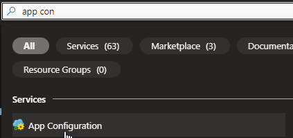

# Azure App Configuration <[MS Learn](https://learn.microsoft.com/nl-nl/azure/azure-app-configuration/overview)>

Azure App Configuration is een beheerde service die wordt aangeboden binnen Microsoft Azure voor het centraal beheren van applicatie-instellingen en feature flags. Het stelt ontwikkelaars in staat om de configuratie van hun applicaties te beheren op een centrale locatie, waardoor de flexibiliteit en het beheer van de configuratie-instellingen verbeteren.

- **Belangrijke kenmerken**:
Centrale configuratie-opslag: De service biedt een centrale opslagplaats voor verschillende soorten applicatieconfiguraties, zoals sleutel-waardeparen, geheimen, aangepaste instellingen, enzovoort.

- **Dynamische wijzigingen**: Ontwikkelaars kunnen wijzigingen in de configuratie dynamisch doorvoeren zonder dat daarvoor een herstart van de applicatie vereist is. Dit maakt het mogelijk om snel configuratiewijzigingen door te voeren en te reageren op veranderende omstandigheden.

- **Feature flags**: Azure App Configuration ondersteunt het gebruik van feature flags, waardoor ontwikkelaars functionele mogelijkheden binnen een applicatie dynamisch kunnen in- of uitschakelen. Dit stelt teams in staat om geleidelijke implementaties uit te voeren, experimenten uit te voeren en functionaliteiten te testen voordat ze breed worden uitgerold.

- **Versiebeheer**: Het biedt versiebeheer voor configuratie-instellingen, waardoor ontwikkelaars gemakkelijk wijzigingen kunnen traceren, vergelijken en teruggaan naar vorige versies indien nodig.

Door het gebruik van Azure App Configuration kunnen ontwikkelaars en operationele teams gemakkelijker omgaan met configuratiebeheer en het implementeren van wijzigingen in applicatie-instellingen. Het verhoogt de flexibiliteit, maakt snelle iteraties mogelijk en verbetert de beheersbaarheid van applicatieconfiguraties in Azure-gebaseerde applicaties.

# Know-How Theorie
### Welk probleem lost Azure App Configuration op?
Azure App Configuration is een Azure-service die gebruikers in staat stelt om configuratie binnen de cloud te beheren. Gebruikers kunnen App Configuration stores maken om key-value instellingen op te slaan en opgeslagen instellingen te consumeren vanuit applicaties, build pipelines, release processen, microservices en andere Azure-resources

### Welke key termen horen bij Azure App Configuration?

### Hoe past Azure App Configuration / vervangt Azure App Configuration in een on-premises setting?
Azure App Configuratie kan zowel on-premises als in de cloud gebruikt worden om resources te optimaliseren

### Hoe kan ik Azure App Configuration combineren met andere diensten?

### Wat is het verschil tussen Azure App Configuration en andere gelijksoortige diensten?
Deze service is specifiek voor Azure ontwikkeld.

## Know-How Praktijk
### Waar kan ik deze dienst vinden in de console?
Deze service is te vinden door gebruik te maken van de zoekfunctie.

### Hoe zet ik deze dienst aan?
Om deze dienst aan te zetten dien je een App configuration aan te maken.

### Hoe kan ik deze dienst koppelen aan andere resources?

## Bronnen
[MS Learn](https://learn.microsoft.com/nl-nl/azure/azure-app-configuration/overview)>