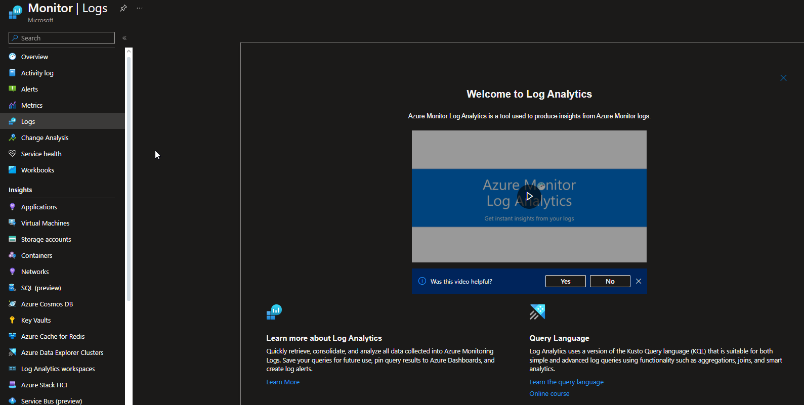

# Azure Monitor Logs <[MS Learn](https://learn.microsoft.com/nl-nl/azure/azure-monitor/logs/data-platform-logs)>

Azure Monitor Logs, voorheen bekend als Log Analytics, is een service binnen Azure waarmee je gegevens kunt verzamelen, opslaan en analyseren vanuit verschillende bronnen om inzicht te verkrijgen in de prestaties en de gezondheid van je Azure-resources en applicaties.

Belangrijke aspecten van Azure Monitor Logs zijn:

- **Data Collection**: Het stelt je in staat om loggegevens en metrische gegevens te verzamelen van diverse bronnen zoals Azure-resources, on-premises servers, containers, applicaties, en meer. Deze gegevens worden opgeslagen in een centrale repository.

- **Querying en Analyse**: Azure Monitor Logs biedt een krachtige querytaal, Kusto Query Language (KQL), waarmee je complexe vragen kunt stellen over de verzamelde gegevens. Hiermee kun je gegevens doorzoeken, filteren, analyseren en visualiseren om inzicht te krijgen in trends, problemen te identificeren of rapporten te genereren.

- **Monitoring en Diagnostics**: Het stelt je in staat om dashboards te maken voor monitoring en diagnostiek, waardoor je real-time inzicht krijgt in de prestaties en status van je resources. Je kunt aangepaste waarschuwingen instellen op basis van queryresultaten, zodat je proactief op de hoogte wordt gebracht van afwijkingen of problemen.

- **Integratie met andere Azure-services**: Azure Monitor Logs integreert met andere services binnen Azure, waaronder Azure Monitor, Azure Security Center, en meer, waardoor je een holistisch inzicht krijgt in de gezondheid, prestaties en beveiliging van je Azure-infrastructuur en applicaties.

Door het gebruik van Azure Monitor Logs kunnen gebruikers uitgebreide analyses uitvoeren op grote hoeveelheden gegevens om operationele inzichten te verkrijgen, prestaties te verbeteren, problemen op te lossen en de algehele efficiëntie van Azure-implementaties te verhogen.

# Know-How Theorie
### Welk probleem lost Azure Monitor Logs op?
Azure Monitor-logboeken is een functie van Azure Monitor waarmee logboek- en prestatiegegevens van bewaakte resources worden verzameld en ingedeeld. Verschillende functies van Azure Monitor slaan hun gegevens op in logboeken en presenteren deze gegevens op verschillende manieren om u te helpen bij het bewaken van de prestaties en beschikbaarheid van uw cloud- en hybride toepassingen en de bijbehorende onderdelen.

### Welke key termen horen bij Azure Monitor Logs?

### Hoe past Azure Monitor Logs / vervangt Azure Monitor Logs in een on-premises setting?
Door middel van interactieve analyses kunnen resources geoptimaliseerd worden.

### Hoe kan ik Azure Monitor Logs combineren met andere diensten?
Door middel van logboekqueries in Log Analystics kunnen resultaten interactief geanalyseerd worden door Azure Monitor. 

### Wat is het verschil tussen Azure Monitor Logs en andere gelijksoortige diensten?
Logboek van de Azure Monitor resource.

## Know-How Praktijk
### Waar kan ik deze dienst vinden in de console?
Onder Monitor bij het kopje Logs.

### Hoe zet ik deze dienst aan?
Deze dienst kom in werking na een analyse van Azure Monitor.

### Hoe kan ik deze dienst koppelen aan andere resources?
Door middel van analyses is deze dienst te koppelen aan andere resources.

## Bronnen
[MS Learn](https://learn.microsoft.com/nl-nl/azure/azure-monitor/logs/data-platform-logs)