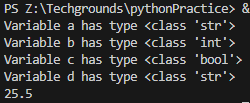
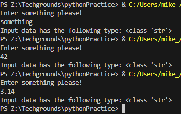

# Data Types and Comments

## Introduction
Under the hood, a computer can only see strings of zeros and ones. Programming languages make use of data types to tell the computer how to interpret those strings. For example, when the computer needs to read the binary string 01000001, it will need to know the data type to determine whether it means 65 or “A”.

This is a non-exhaustive list of some of the most important data types in Python:

- ***boolean*** 
    - A binary state that is either True or False.
    - boolean = ***True***
- ***String***
    - Technically an array of characters. Strings are denoted using “ ” double quotes or ‘ ’ single quotes.
    - string = ***"This is a string"***
- ***Int***
    - An integer is a whole number. Ints can be both positive and negative.
    - integer = ***6***
- ***Float***
    - A floating-point number is a decimal number.
    - floating_point = ***18.5***

Comments are lines that do not get processed as code. This can be used for multiple purposes. For example, you can write a short description of what a block of code does. You can also ‘comment out’ some code, so that it is temporarily removed. This can be useful for testing and debugging.

*Note: This is done with # for a single line and """ around a multi-line block """*

## Exercise 1

- Create a new script.
- Copy the code below into your script.

    a = 'int'   
    b = 7   
    c = False   
    d = "18.5"  

- Determine the data types of all four variables ( a, b, c, d) using a built-in function.
- Make a new variable x and give it the value b + d. Print the value of x. This will raise an error. Fix it so that print(x) prints a float.
- Write a comment above every line of code that tells the reader what is going on in your script.

### Code

    # Different types of variables
    a = "int"
    b = 7
    c = False
    d = "18.5"

    # Print each variable type(), type converted to str to attach to rest of output string.
    print("Variable a has type " + str(type(a)))
    print("Variable b has type " + str(type(b)))
    print("Variable c has type " + str(type(c)))
    print("Variable d has type " + str(type(d)))

    # d is set as a string, convert to float so it can be used in sum and print result
    x = b + float(d)
    print (x)

*script5.py*
### Output

## Exercise 2

- Create a new script.
- Use the input() function to get input from the user. Store that input in a variable.
- Find out what data type the output of input() is. See if it is different for different kinds of input (numbers, words, etc.).

### Code

    data = input("Enter something please!\n")
    print("Input data has the following type: " + str(type(data)))

*script6.py*
### Output

