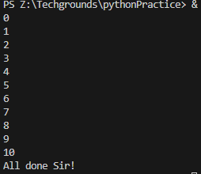
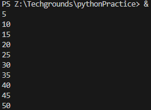
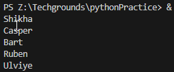

# Loops

## Introduction
You can use loops when you want to run a block of code multiple times. For example, you might want to do an operation on every item in a (large) list, or you want to write an algorithm that follows the same set of instructions for multiple iterations.

There are two types of loops in Python: the while loop and the for loop.The while loop runs while a condition is true. They can run indefinitely if that condition never changes. If your code is stuck in an infinite loop, just press ctrl-c (or command-c on MacOS) to force quit the running code.The for loop runs for a predetermined number of iterations. This number can be hard coded using the range() function, or dynamically assigned (using a variable, the size of a list, or the number of lines in a document). It is also possible to accidentally create an infinite for loop. You can use the same command (ctrl/cmd+c) to exit your program.

## Exercise 1
- Create a new script.
- Create a variable x and give it the value 0.
- Use a while loop to print the value of x in every iteration of the loop. After printing, the value of x should increase by 1. The loop should run as long as x is smaller than or equal to 10.

### Code
while loop  

    # while True loop: counts from 0 to 10
    x = 0

    while True:
        if x > 10:   
            break

        print(x)
        x += 1
        
        if x > 10:
            print("All done Sir!")
            exit()

for loop (copied from current script7.py)

    # for in range() loop: repeat loop until range is reached (x is set to 0 by python)
    # Note: this loop won't run atm because the exit() in the while loop!
    for y in range(11):
        y <= 10    
        print(y)

        y > 10
        print("All done Sir!")

*script7.py*

### Output

## Exercise 2
- Create a new script.
- Copy the code below into your script.

    for i in range(10):     
    .# do something here    (remove .)

- Print the value of i in the for loop. You did not manually assign a value to i. Figure out how its value is determined.
- Add a variable x with value 5 at the top of your script.
- Using the for loop, print the value of x multiplied by the value of i, for up to 50 iterations.

### Code

    x = 5
    for i in range(10):
        print(i * x + 5) 

*script8.py*

### Output

## Exercise 3
- Create a new script.
- Copy the array below into your script.    

    arr = ["Shikha", "Casper", "Bart", "Ruben", "Ulviye"]
- Use a for loop to loop over the array. Print every name individually.

### Code

Loop through array
    arr = ["Shikha", "Casper", "Bart", "Ruben", "Ulviye"]

    # loop through array and print individually
    for i in range(arr):
        print(arr[i])

Same loop but shorter

    # SHORTER.. same as before but less lines
    [print(x) for x in arr]

*script9.py*

### Output
