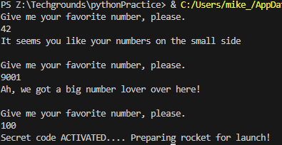

# Conditions

## Introduction
Very often, you will want to run a piece of code only when certain conditions are met. For example, you might want to write something to an error log only if the reply you receive from a server contains an error.Python makes use of the if, elif, and else statements.

## Exercise 1
- Create a new script.
- Use the input() function to ask the user of your script for their name. If the name they input is your name, print a personalized welcome message. If not, print a different personalized message.

### Code
    name = input("What is your name?\n")

    if name == "Mike" or name == "mike":
        print("Come on in " + name + "!")
    else: 
        print("Keep walking " + name + "! We don't allow your kind in here")

*script10.py*

### Output

## Exercise 2
- Create a new script.
- Ask the user of your script for a number. Give them a response based on whether the number is higher than, lower than, or equal to 100.
- Make the game repeat until the user inputs 100.

### Code

    number = 0
    while number != 100:
        number = input("Give me your favorite number, please.\n")

        if int(number) < 100:
            print("It seems you like your numbers on the small side\n")

        elif int(number) > 100:
            print("Ah, we got a big number lover over here!\n")
        else:
            print("Secret code ACTIVATED.... Preparing rocket for launch!")
            exit()

*script11.py*

### Output
