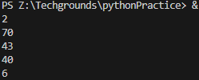
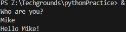
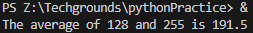

# Functions

## Introduction
You’ve already seen and used a couple of functions, like print() and input(). A function is a block of code that only runs when it is called. Functions are recognizable by the brackets () next to the function name. These brackets serve as a place to input data into a function.Functions return data as a result.

Besides the built-in functions, you can also write custom functions, or import functions from a library or package.
## Exercise 1
- Create a new script.
- Import the random package.
- Print 5 random integers with a value between 0 and 100.

### Code

    # import random function
    import random

    for x in range(5):
        print(random.randint(1,100))

*script12.py*

### Output

## Exercise 2
- Create a new script.
- Write a custom function myfunction() that prints “Hello, world!” to the terminal. Call myfunction.
- Rewrite your function so that it takes a string as an argument. Then, it should print “Hello, NAME!”.

### Code

    name = input("Who are you?\n")

    def myFunction():
        print("Hello " + str(name) + "!")

    myFunction()

*script13.py*

### Output

## Exercise 3
- Create a new script. 

Copy the code below into your script.

    def avg():
    # write your code here
    # you are not allowed to edit any code below here

    x = 128
    y = 255
    z = avg(x,y)

    print("The average of",x,"and",y,"is",z)

- Write the custom function avg() so that it returns the average of the given parameters. You are not allowed to edit any code below the second comment.
### Code

    def avg(x,y):   
    # write your code here
        return (x + y) / 2

    # you are not allowed to edit any code below here
    x = 128
    y = 255
    z = avg(x,y)

    print("The average of",x,"and",y,"is",z)

*script14.py*
### Output
