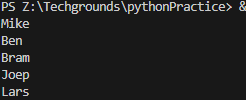
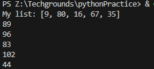

# Lists

## Introduction
You can declare a list of values in a single variable. A list is represented by square brackets [ ], and each value is separated by a comma.

Each position in a list has a number associated with it called the index. Indexes start at 0, so the first item in a list will have the index 0. The second item will have index 1, etc. You can call individual items in a list by calling its index.

You can loop over a list using a for loop. Instead of a number within a range, i (or whatever you name the variable you declare) will have the value of an item in the list. You can still use range() to loop over a list. In this case, i will be used to call an index in a list.

## Exercise 1
- Create a new script.
- Create a variable that contains a list of five names.
- Loop over the list using a for loop. Print every individual name in the list on a new line.

### Code

    list = ["Mike", "Ben", "Bram", "Joep", "Lars"]
    print(*list, sep="\n")

*script15.py*

### Output

## Exercise 2
- Create a new script.
- Create a list of five integers.
- Use a for loop to do the following for every item in the list:
    - Print the value of that item added to the value of the next item in the list.
    - If it is the last item, add it to the value of the first item instead (since there is no next item).

The first result above is created by adding 9 and 80. The second result is created by adding 80 and 16, etc. The last result is created by adding 35 and 9.

### Code

loop to go through list with pre-defined size

    list = [9, 80, 16, 67, 35]
    print("My list: " + str(list))

    # go through loop with baked-in list size
    """for i in range(5):
        if i == 4:
            print(list[i] + list[0])
        else:
            print(list[i] + list[i+1])"""

same loop to go through list but flexible on list size

    # loop to go through list
    for i in range(len(list)):
        # if i is equal to length of list (len(list) -1 because i starts at 0 instead of 1)
        if i == (len(list)-1):
            print(list[i] + list[0])
        else:
            print(list[i] + list[i+1])

*script16.py*

### Output

