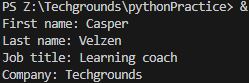
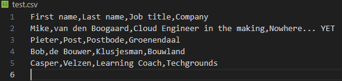

# Key-value Pairs

## Introduction
Key-value pairs are a general concept you will definitely encounter. Some examples of where you will find them are NoSQL databases or AWS/Azure resource tags. Dictionaries (dict) in Python also use key-value pairs to store information. Dicts in Python are written using curly brackets {}. You can get values from the dict by calling its key.

## Exercise 1
- Create a new script.
- Create a dictionary with the following keys and values:

|Key |Value|
|---|---|
|First name |Casper|
|Last name |Velzen|
|Job title |Learning coach|
|Company |Techgrounds|

- Loop over the dictionary and print every key-value pair in the terminal.

### Code

    personDicionary = {}
    personDicionary["First name"] = "Casper"
    personDicionary["Last name"] = "Velzen"
    personDicionary["Job title"] = "Learning coach"
    personDicionary["Company"] = "Techgrounds"

    for key in personDicionary:
        print(key + ": " + personDicionary.get(key))

*script17.py*
### Output

## Exercise 2
- Create a new script.
- Use user input to ask for their information (first name, last name, job title, company). Store the information in a dictionary.
- Write the information to a csv file (comma-separated values). The data should not be overwritten when you run the script multiple times.

### Code

    import csv 
    from csv import DictWriter

    firstName = "What is your first name?\n"
    lastName = "What is your last name?\n"
    jobTitle = "What is your profession?\n"
    company = "Where do you work?\n"

    personDict = {}
    personDict["First name"] = input(firstName)
    personDict["Last name"] = input(lastName)
    personDict["Job title"] = input(jobTitle)
    personDict["Company"] = input(company)

    fieldNames = ["First name", "Last name", "Job title", "Company"]

    with open("test.csv", "a", newline='') as f:  
        writer = DictWriter(f,fieldnames=fieldNames)
        if f.tell() == 0:
            writer.writeheader()

        writer.writerow(personDict)
        f.close()

*script18.py*

### Output
