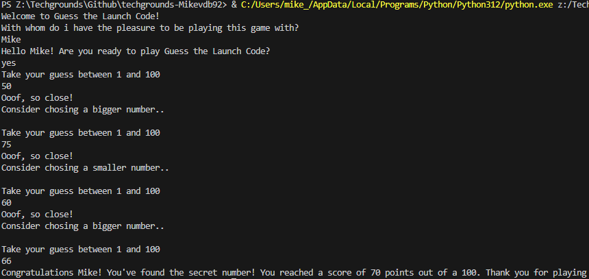

# Mini Projects

## Number Guessing:

### Requirements
- Generate a random number between 1 and 100 (or any other range).
- The player guesses a number. For every wrong answer the player receives a clue.
- When the player guesses the right number, display a score.

### Code

    import random

    # welcome player
    print("Welcome to Guess the Launch Code!")
    playerName = input("With whom do i have the pleasure to be playing this game with?\n")
    ready = input("Hello "  + playerName + "! Are you ready to play Guess the Launch Code?\n")
    if ready == "yes" or ready == "Yes":
        # make random number between 1-100
        randomNumber = random.randint(1,100)
        score = 100

        # player guess input
        while True:   
            playerGuess = int(input("Take your guess between 1 and 100\n"))

            if playerGuess == randomNumber:

                print("Congratulations "+ playerName + "! You've found the secret launch code! You reached a score of " + str(score) + " points out of a 100. Thank you for playing")
                exit()
            else:
                score -= 10
                print("Ooof, so close!")
                if randomNumber < playerGuess:
                    print("Consider chosing a smaller number..\n")
                else:
                    print("Consider chosing a bigger number..\n")
                            
    else:
        print("Uhm.. Now what.. Bye i guess?")
        exit()

### Preview

## Rock Paper Scissors:
### Requirements
- The player plays against a computer opponent typing either a letter (rps) or an entire word (rock paper scissors) to play their move.
- Create a function that checks whether the move is valid or not.
- Create another function to create a computer move.
- Create another function to check who wins the round.
- Finally, create a function that keeps track of the score.
- The game should be played in a predetermined number of rounds.

### Code

### Preview

