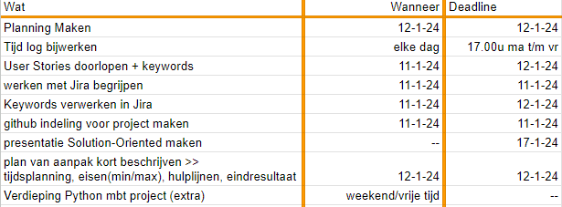

# Log [10-1]

## Dagverslag (1 zin)
Vandaag ben ik bezig geweest met het doorlezen/begrijpen van het eindproject en een "ruwe" planning gemaakt voor deze week.

## Obstakels
In eerste instantie flink opkijkend tegen een berg werk qua eindproject, hierdoor vond ik het moeilijk om een begin te maken en vooral te bedenken waar te beginnen.

## Oplossingen
Ruwe planning gemaakt zoals hieronder te zien is. Hiermee onderdelen kunnen benoemen die deze week gedaan moeten worden en een plan van aanpak voor mezelf gemaakt.

Planning week 10:   

## Learnings
